# 科研图形图鉴

这里收录 **180 个可检索科研图形案例**。图鉴用于识别信息结构、比较表达方案和定位可复用模板，不是要求用户机械复刻固定版式。

- **开放模板**：包含案例中立化的 Python/R 双实现、演示数据和运行说明。
- **图鉴案例**：开放缩略图、检索元数据和通用提示词，不包含对应案例的完整源码。
- 图片仅用于结构参考；不得照搬案例中的名称、数值、阈值或统计结论。
- 分类代表图来自图鉴；开放模板是案例中立化实现，不承诺与图鉴逐像素相同。

[返回项目首页](README.md) · [查看 23 个开放模板](#open-templates) · [了解资产边界](CASE_ASSETS.md)

## 按表达目标浏览

| 表达目标 | 案例数 | 开放模板 | 适合回答的问题 |
|---|---:|---:|---|
| [比较与估计](#comparison-estimation) | 40 | 4 | 组间差异、效应量、置信区间与响应排序。 |
| [分布与不确定性](#distribution-uncertainty) | 22 | 2 | 原始观测、分布形态、误差、配对变化与不确定性。 |
| [关系与模型](#relationships-models) | 22 | 2 | 变量关系、回归拟合、非线性效应与模型诊断。 |
| [矩阵与模式](#matrices-patterns) | 27 | 3 | 高维矩阵、相关结构、热图、排名与多层注释。 |
| [组成与集合](#composition-sets) | 19 | 3 | 比例构成、集合交并、多成分约束与组间组成变化。 |
| [网络与流向](#networks-flows) | 15 | 2 | 节点连接、模块结构、传播路径与流量变化。 |
| [空间与层级](#spatial-hierarchy) | 13 | 2 | 地理分布、空间分区、嵌套结构与层级关系。 |
| [时间与过程](#time-process) | 11 | 2 | 生存、时间序列、事件轨迹与个体过程。 |
| [降维与聚类](#embedding-clustering) | 11 | 3 | 低维嵌入、群落差异、聚类结果与模块注释。 |

> 页面只加载每类 3 张代表图；全部 180 条案例以可展开文字索引呈现。这样保留浏览广度，同时避免一次加载 180 张图片。

## 23 个开放模板

这些案例提供案例中立化的 Python/R 双实现、演示数据、运行说明和双版本预览。

<strong>展开开放模板清单</strong>

| No. | 表达目标 | 开放模板 |
|---|---|---|
| [`rf-0001`](skills/academic-figure/templates/rf-0001-faceted-composition/README.md) | 组成与集合 | [分面堆积柱状图](skills/academic-figure/templates/rf-0001-faceted-composition/README.md) |
| [`rf-0018`](skills/academic-figure/templates/rf-0018-survival-risk-table/README.md) | 时间与过程 | [生存曲线](skills/academic-figure/templates/rf-0018-survival-risk-table/README.md) |
| [`rf-0026`](skills/academic-figure/templates/rf-0026-subject-timeline/README.md) | 时间与过程 | [泳道图](skills/academic-figure/templates/rf-0026-subject-timeline/README.md) |
| [`rf-0027`](skills/academic-figure/templates/rf-0027-baseline-table/README.md) | 比较与估计 | [基线特征表](skills/academic-figure/templates/rf-0027-baseline-table/README.md) |
| [`rf-0041`](skills/academic-figure/templates/rf-0041-embedding-composition/README.md) | 降维与聚类 | [单细胞UMAP+细胞占比图](skills/academic-figure/templates/rf-0041-embedding-composition/README.md) |
| [`rf-0044`](skills/academic-figure/templates/rf-0044-clustered-network/README.md) | 网络与流向 | [聚类网络图](skills/academic-figure/templates/rf-0044-clustered-network/README.md) |
| [`rf-0049`](skills/academic-figure/templates/rf-0049-relationship-matrix/README.md) | 矩阵与模式 | [多变量比较和相关性分析矩阵图](skills/academic-figure/templates/rf-0049-relationship-matrix/README.md) |
| [`rf-0054`](skills/academic-figure/templates/rf-0054-clustered-matrix-enrichment/README.md) | 降维与聚类 | [基因聚类富集注释热图](skills/academic-figure/templates/rf-0054-clustered-matrix-enrichment/README.md) |
| [`rf-0063`](skills/academic-figure/templates/rf-0063-clinical-feature-landscape/README.md) | 矩阵与模式 | [临床特征热图](skills/academic-figure/templates/rf-0063-clinical-feature-landscape/README.md) |
| [`rf-0066`](skills/academic-figure/templates/rf-0066-hierarchy-sunburst/README.md) | 空间与层级 | [旭日图](skills/academic-figure/templates/rf-0066-hierarchy-sunburst/README.md) |
| [`rf-0091`](skills/academic-figure/templates/rf-0091-ordination/README.md) | 降维与聚类 | [PCOA Marginal Boxplots Permanova](skills/academic-figure/templates/rf-0091-ordination/README.md) |
| [`rf-0100`](skills/academic-figure/templates/rf-0100-regression-diagnostics/README.md) | 关系与模型 | [Scatter Marginal Histogram Regression Residual Boxplot](skills/academic-figure/templates/rf-0100-regression-diagnostics/README.md) |
| [`rf-0104`](skills/academic-figure/templates/rf-0104-raincloud/README.md) | 分布与不确定性 | [Violin Box Beeswarm Raincloud](skills/academic-figure/templates/rf-0104-raincloud/README.md) |
| [`rf-0107`](skills/academic-figure/templates/rf-0107-feature-enrichment/README.md) | 比较与估计 | [Volcano Preranked GSEA Enrichment Scores](skills/academic-figure/templates/rf-0107-feature-enrichment/README.md) |
| [`rf-0109`](skills/academic-figure/templates/rf-0109-benchmark-heatmap/README.md) | 矩阵与模式 | [Benchmark Ranking Table Heatmap](skills/academic-figure/templates/rf-0109-benchmark-heatmap/README.md) |
| [`rf-0118`](skills/academic-figure/templates/rf-0118-sankey/README.md) | 网络与流向 | [Sankey Diagram](skills/academic-figure/templates/rf-0118-sankey/README.md) |
| [`rf-0122`](skills/academic-figure/templates/rf-0122-spatial-composition-map/README.md) | 空间与层级 | [Sample Geographic Distribution Maps](skills/academic-figure/templates/rf-0122-spatial-composition-map/README.md) |
| [`rf-0133`](skills/academic-figure/templates/rf-0133-nonlinear-survival-effects/README.md) | 关系与模型 | [Restricted Cubic Spline COX Regression](skills/academic-figure/templates/rf-0133-nonlinear-survival-effects/README.md) |
| [`rf-0157`](skills/academic-figure/templates/rf-0157-upset/README.md) | 组成与集合 | [Upset Intersection Plots](skills/academic-figure/templates/rf-0157-upset/README.md) |
| [`rf-0162`](skills/academic-figure/templates/rf-0162-ternary-composition/README.md) | 组成与集合 | [Ternary Plots](skills/academic-figure/templates/rf-0162-ternary-composition/README.md) |
| [`rf-0164`](skills/academic-figure/templates/rf-0164-ordered-response/README.md) | 比较与估计 | [Point Line Response Plot](skills/academic-figure/templates/rf-0164-ordered-response/README.md) |
| [`rf-0172`](skills/academic-figure/templates/rf-0172-forest/README.md) | 比较与估计 | [Forest Plots](skills/academic-figure/templates/rf-0172-forest/README.md) |
| [`rf-0173`](skills/academic-figure/templates/rf-0173-paired-change/README.md) | 分布与不确定性 | [Paired Boxplots](skills/academic-figure/templates/rf-0173-paired-change/README.md) |

## 比较与估计

组间差异、效应量、置信区间与响应排序，共 **40** 个案例，其中 **4** 个开放模板。

<table role="presentation">
  <tr>
    <td width="33%"></td>
    <td width="33%"><a href="skills/academic-figure/templates/rf-0164-ordered-response/README.md">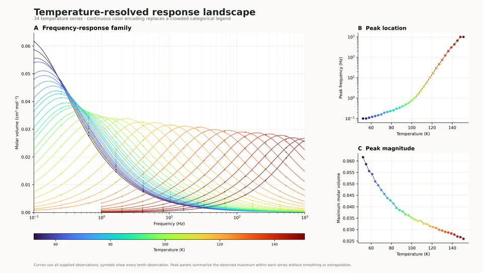</a></td>
    <td width="33%"><a href="skills/academic-figure/templates/rf-0172-forest/README.md">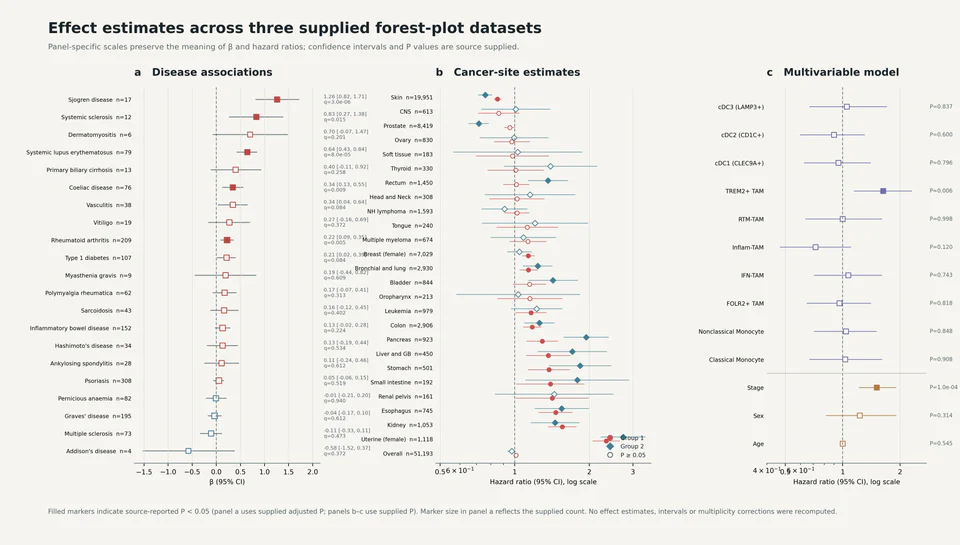</a></td>
  </tr>
  <tr>
    <td><code>rf-0107</code> <strong>Volcano Preranked GSEA Enrichment Scores</strong> 开放模板</td>
    <td><code>rf-0164</code> <strong>Point Line Response Plot</strong> 开放模板</td>
    <td><code>rf-0172</code> <strong>Forest Plots</strong> 开放模板</td>
  </tr>
</table>

<strong>查看“比较与估计”全部 40 个案例</strong>

| 案例 | 图形类型 | 开放状态 |
|---|---|---|
| [`rf-0005` · 差异基因火山图](skills/academic-figure/assets/case-atlas/rf-0005-differential-gene-volcano/) | 火山与曼哈顿 | 图鉴案例 |
| [`rf-0006` · 分组折线图+蜂群点图+柱状图](skills/academic-figure/assets/case-atlas/rf-0006-treatment-response-panels/) | 柱形与棒棒糖 | 图鉴案例 |
| [`rf-0009` · 多组比较火山图](skills/academic-figure/assets/case-atlas/rf-0009-multigroup-volcano/) | 火山与曼哈顿 | 图鉴案例 |
| [`rf-0021` · 基因集富集（GSEA）图](skills/academic-figure/assets/case-atlas/rf-0021-gsea-enrichment-plot/) | 富集分析图 | 图鉴案例 |
| [`rf-0027` · 基线特征表](skills/academic-figure/templates/rf-0027-baseline-table/README.md) | 表格与流程图 | **Python/R 模板** |
| [`rf-0030` · 多分组火山图](skills/academic-figure/assets/case-atlas/rf-0030-multigroup-volcano/) | 火山与曼哈顿 | 图鉴案例 |
| [`rf-0031` · 风车图](skills/academic-figure/assets/case-atlas/rf-0031-windmill-plot/) | 柱形与棒棒糖 | 图鉴案例 |
| [`rf-0034` · 瀑布图](skills/academic-figure/assets/case-atlas/rf-0034-waterfall-plot/) | 柱形与棒棒糖 | 图鉴案例 |
| [`rf-0036` · 棒棒糖图+GO富集条形图](skills/academic-figure/assets/case-atlas/rf-0036-go-enrichment-plot/) | 富集分析图 | 图鉴案例 |
| [`rf-0039` · 雷达图蜘蛛图](skills/academic-figure/assets/case-atlas/rf-0039-radar-spider-plots/) | 雷达与极坐标 | 图鉴案例 |
| [`rf-0052` · 多分组环状火山图](skills/academic-figure/assets/case-atlas/rf-0052-circular-volcano/) | 火山与曼哈顿、雷达与极坐标 | 图鉴案例 |
| [`rf-0068` · 花瓣图（环形柱状图）](skills/academic-figure/assets/case-atlas/rf-0068-petal-plot/) | 柱形与棒棒糖 | 图鉴案例 |
| [`rf-0082` · 基因集富集排序气泡图](skills/academic-figure/assets/case-atlas/rf-0082-gene-set-enrichment-ranked-bubble/) | 散点与气泡、富集分析图 | 图鉴案例 |
| [`rf-0084` · 双曲线火山图](skills/academic-figure/assets/case-atlas/rf-0084-hyperbolic-volcano/) | 火山与曼哈顿 | 图鉴案例 |
| [`rf-0087` · Cox亚组分析森林图](skills/academic-figure/assets/case-atlas/rf-0087-cox-subgroup-forest-plot/) | 森林与生存图 | 图鉴案例 |
| [`rf-0088` · Cox回归森林图](skills/academic-figure/assets/case-atlas/rf-0088-cox-forest-plot/) | 森林与生存图 | 图鉴案例 |
| [`rf-0089` · 结核病cfRNA分析](skills/academic-figure/assets/case-atlas/rf-0089-cfrna-tb/) | 柱形与棒棒糖 | 图鉴案例 |
| [`rf-0090` · Bar Scatter Error Bars Significance](skills/academic-figure/assets/case-atlas/rf-0090-bar-scatter-error-bars-significance/) | 柱形与棒棒糖、散点与气泡 | 图鉴案例 |
| [`rf-0092` · Line Bar Error Bars Multiple Comparisons](skills/academic-figure/assets/case-atlas/rf-0092-line-bar-error-bars-multiple-comparisons/) | 柱形与棒棒糖、折线与曲线 | 图鉴案例 |
| [`rf-0094` · Grouped Bars Error Bars Jittered Points T Tests](skills/academic-figure/assets/case-atlas/rf-0094-grouped-bars-error-bars-jittered-points-t-tests/) | 柱形与棒棒糖、散点与气泡 | 图鉴案例 |
| [`rf-0095` · Dual Axis GO Enrichment Bars](skills/academic-figure/assets/case-atlas/rf-0095-dual-axis-go-enrichment-bars/) | 柱形与棒棒糖、富集分析图 | 图鉴案例 |
| [`rf-0107` · Volcano Preranked GSEA Enrichment Scores](skills/academic-figure/templates/rf-0107-feature-enrichment/README.md) | 火山与曼哈顿、富集分析图 | **Python/R 模板** |
| [`rf-0112` · Volcano Descriptive GSEA Enrichment Map](skills/academic-figure/assets/case-atlas/rf-0112-volcano-descriptive-gsea-enrichment-map/) | 火山与曼哈顿、富集分析图 | 图鉴案例 |
| [`rf-0120` · Circular Cohort Characteristics](skills/academic-figure/assets/case-atlas/rf-0120-circular-cohort-characteristics/) | 雷达与极坐标 | 图鉴案例 |
| [`rf-0121` · Polar Bar Error Bar Variants](skills/academic-figure/assets/case-atlas/rf-0121-polar-bar-error-bar-variants/) | 柱形与棒棒糖、雷达与极坐标 | 图鉴案例 |
| [`rf-0123` · Polar Lollipop Plot](skills/academic-figure/assets/case-atlas/rf-0123-polar-lollipop-plot/) | 柱形与棒棒糖、雷达与极坐标 | 图鉴案例 |
| [`rf-0128` · Grouped Bars Anova Post Hoc Comparisons](skills/academic-figure/assets/case-atlas/rf-0128-grouped-bars-anova-post-hoc-comparisons/) | 柱形与棒棒糖 | 图鉴案例 |
| [`rf-0134` · Faceted Stacked Bars Error Bars Significance](skills/academic-figure/assets/case-atlas/rf-0134-faceted-stacked-bars-error-bars-significance/) | 柱形与棒棒糖 | 图鉴案例 |
| [`rf-0136` · Multi Panel Radar Charts](skills/academic-figure/assets/case-atlas/rf-0136-multi-panel-radar-charts/) | 雷达与极坐标 | 图鉴案例 |
| [`rf-0138` · Dual Axis GO Enrichment Nested Bars](skills/academic-figure/assets/case-atlas/rf-0138-dual-axis-go-enrichment-nested-bars/) | 柱形与棒棒糖、富集分析图 | 图鉴案例 |
| [`rf-0147` · Circular Gradient Bars Grouped Lines](skills/academic-figure/assets/case-atlas/rf-0147-circular-gradient-bars-grouped-lines/) | 柱形与棒棒糖、雷达与极坐标 | 图鉴案例 |
| [`rf-0150` · Difference Radar Charts](skills/academic-figure/assets/case-atlas/rf-0150-difference-radar-charts/) | 雷达与极坐标 | 图鉴案例 |
| [`rf-0151` · Grouped Ungrouped Circular Bars](skills/academic-figure/assets/case-atlas/rf-0151-grouped-ungrouped-circular-bars/) | 柱形与棒棒糖、雷达与极坐标 | 图鉴案例 |
| [`rf-0155` · Multi Group Volcano Plots](skills/academic-figure/assets/case-atlas/rf-0155-multi-group-volcano-plots/) | 火山与曼哈顿 | 图鉴案例 |
| [`rf-0156` · Volcano Plots Enrichment Results](skills/academic-figure/assets/case-atlas/rf-0156-volcano-plots-enrichment-results/) | 火山与曼哈顿、富集分析图 | 图鉴案例 |
| [`rf-0158` · Differential Otu Manhattan Plot](skills/academic-figure/assets/case-atlas/rf-0158-differential-otu-manhattan-plot/) | 火山与曼哈顿 | 图鉴案例 |
| [`rf-0164` · Point Line Response Plot](skills/academic-figure/templates/rf-0164-ordered-response/README.md) | 折线与曲线 | **Python/R 模板** |
| [`rf-0170` · Hyperbolic Volcano Plots](skills/academic-figure/assets/case-atlas/rf-0170-hyperbolic-volcano-plots/) | 火山与曼哈顿 | 图鉴案例 |
| [`rf-0172` · Forest Plots](skills/academic-figure/templates/rf-0172-forest/README.md) | 森林与生存图 | **Python/R 模板** |
| [`rf-0177` · Inward Circular Bar Chart](skills/academic-figure/assets/case-atlas/rf-0177-inward-circular-bar-chart/) | 柱形与棒棒糖、雷达与极坐标 | 图鉴案例 |

## 分布与不确定性

原始观测、分布形态、误差、配对变化与不确定性，共 **22** 个案例，其中 **2** 个开放模板。

<table role="presentation">
  <tr>
    <td width="33%"><a href="skills/academic-figure/templates/rf-0104-raincloud/README.md">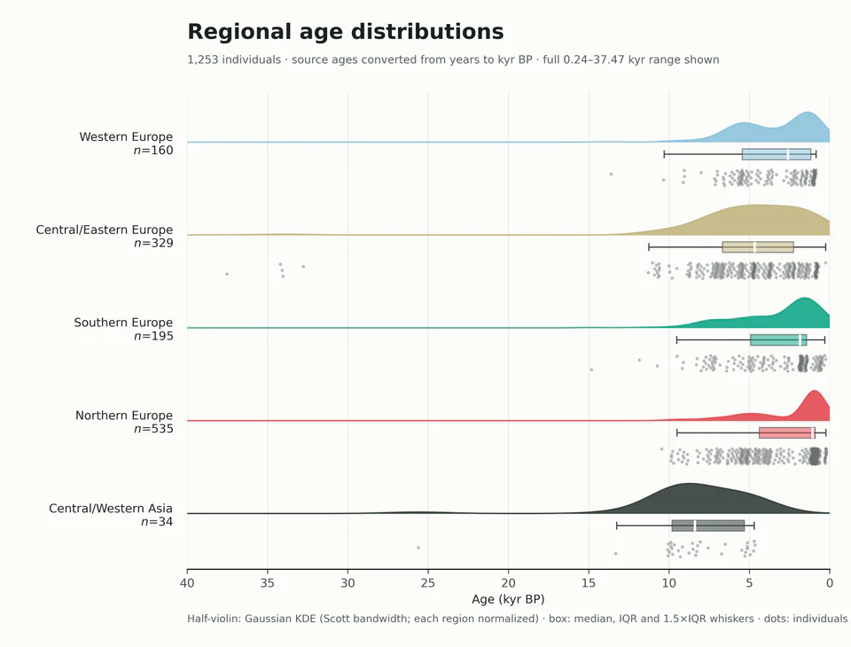</a></td>
    <td width="33%"><a href="skills/academic-figure/assets/case-atlas/rf-0137-difference-raincloud-plots/">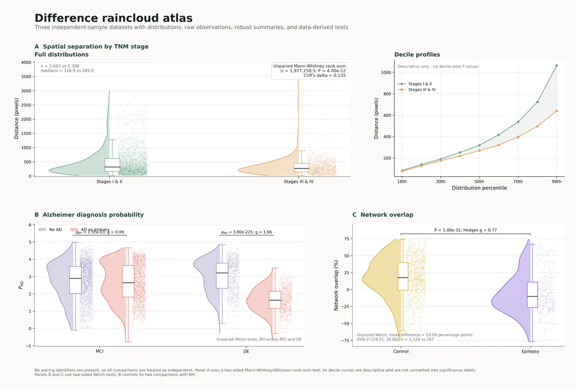</a></td>
    <td width="33%"></td>
  </tr>
  <tr>
    <td><code>rf-0104</code> <strong>Violin Box Beeswarm Raincloud</strong> 开放模板</td>
    <td><code>rf-0137</code> <strong>Difference Raincloud Plots</strong> 图鉴案例</td>
    <td><code>rf-0173</code> <strong>Paired Boxplots</strong> 开放模板</td>
  </tr>
</table>

<strong>查看“分布与不确定性”全部 22 个案例</strong>

| 案例 | 图形类型 | 开放状态 |
|---|---|---|
| [`rf-0003` · 分组比较小提琴图](skills/academic-figure/assets/case-atlas/rf-0003-grouped-violin-plot/) | 箱线与小提琴 | 图鉴案例 |
| [`rf-0014` · 山脊图](skills/academic-figure/assets/case-atlas/rf-0014-ridgeline-annotations/) | 密度与山脊 | 图鉴案例 |
| [`rf-0015` · 箱线图小提琴图云雨图](skills/academic-figure/assets/case-atlas/rf-0015-box-violin-raincloud/) | 箱线与小提琴、密度与山脊 | 图鉴案例 |
| [`rf-0029` · 局部放大图](skills/academic-figure/assets/case-atlas/rf-0029-magnified-histogram/) | 密度与山脊 | 图鉴案例 |
| [`rf-0071` · 云雨图](skills/academic-figure/assets/case-atlas/rf-0071-raincloud-plot/) | 箱线与小提琴、密度与山脊 | 图鉴案例 |
| [`rf-0072` · 带有底部条码的山峦图](skills/academic-figure/assets/case-atlas/rf-0072-ridgeline-barcode/) | 柱形与棒棒糖、密度与山脊 | 图鉴案例 |
| [`rf-0093` · Raincloud Group Comparison](skills/academic-figure/assets/case-atlas/rf-0093-raincloud-group-comparison/) | 箱线与小提琴、密度与山脊 | 图鉴案例 |
| [`rf-0098` · Ridgeline Plot](skills/academic-figure/assets/case-atlas/rf-0098-ridgeline-plot/) | 密度与山脊 | 图鉴案例 |
| [`rf-0103` · Line Box Error Bars Significance Tests](skills/academic-figure/assets/case-atlas/rf-0103-line-box-error-bars-significance-tests/) | 柱形与棒棒糖、箱线与小提琴、折线与曲线 | 图鉴案例 |
| [`rf-0104` · Violin Box Beeswarm Raincloud](skills/academic-figure/templates/rf-0104-raincloud/README.md) | 散点与气泡、箱线与小提琴、密度与山脊 | **Python/R 模板** |
| [`rf-0108` · Grouped Violin Box Significance Tests](skills/academic-figure/assets/case-atlas/rf-0108-grouped-violin-box-significance-tests/) | 箱线与小提琴 | 图鉴案例 |
| [`rf-0110` · Ridgeline Bidirectional Bars](skills/academic-figure/assets/case-atlas/rf-0110-ridgeline-bidirectional-bars/) | 柱形与棒棒糖、密度与山脊 | 图鉴案例 |
| [`rf-0115` · Model Validation Density Box Beeswarm](skills/academic-figure/assets/case-atlas/rf-0115-model-validation-density-box-beeswarm/) | 散点与气泡、箱线与小提琴、密度与山脊 | 图鉴案例 |
| [`rf-0117` · Violin Quartiles Jittered Points Significance](skills/academic-figure/assets/case-atlas/rf-0117-violin-quartiles-jittered-points-significance/) | 散点与气泡、箱线与小提琴 | 图鉴案例 |
| [`rf-0130` · Faceted Ridgeline Plot](skills/academic-figure/assets/case-atlas/rf-0130-faceted-ridgeline-plot/) | 密度与山脊 | 图鉴案例 |
| [`rf-0131` · Butterfly Violin Stacked Bar](skills/academic-figure/assets/case-atlas/rf-0131-butterfly-violin-stacked-bar/) | 柱形与棒棒糖、箱线与小提琴 | 图鉴案例 |
| [`rf-0137` · Difference Raincloud Plots](skills/academic-figure/assets/case-atlas/rf-0137-difference-raincloud-plots/) | 箱线与小提琴、密度与山脊 | 图鉴案例 |
| [`rf-0144` · Abundance Difference Beeswarm](skills/academic-figure/assets/case-atlas/rf-0144-abundance-difference-beeswarm/) | 散点与气泡 | 图鉴案例 |
| [`rf-0148` · Box Fan Semicircular Density Plots](skills/academic-figure/assets/case-atlas/rf-0148-box-fan-semicircular-density-plots/) | 箱线与小提琴、密度与山脊、雷达与极坐标 | 图鉴案例 |
| [`rf-0161` · Violin Plots Significance Annotations](skills/academic-figure/assets/case-atlas/rf-0161-violin-plots-significance-annotations/) | 箱线与小提琴 | 图鉴案例 |
| [`rf-0169` · Faceted Ridgeline Rug Marks](skills/academic-figure/assets/case-atlas/rf-0169-faceted-ridgeline-rug-marks/) | 密度与山脊 | 图鉴案例 |
| [`rf-0173` · Paired Boxplots](skills/academic-figure/templates/rf-0173-paired-change/README.md) | 箱线与小提琴 | **Python/R 模板** |

## 关系与模型

变量关系、回归拟合、非线性效应与模型诊断，共 **22** 个案例，其中 **2** 个开放模板。

<table role="presentation">
  <tr>
    <td width="33%"><a href="skills/academic-figure/templates/rf-0100-regression-diagnostics/README.md">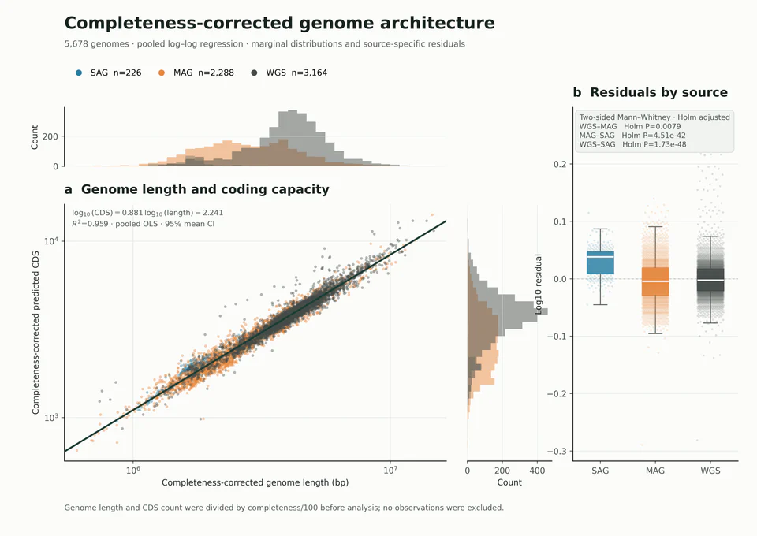</a></td>
    <td width="33%"><a href="skills/academic-figure/templates/rf-0133-nonlinear-survival-effects/README.md">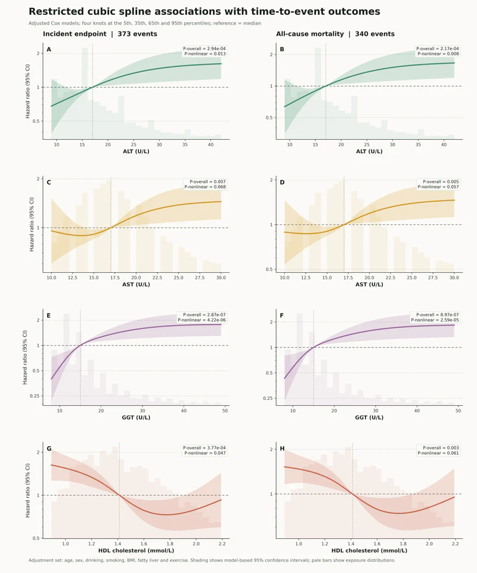</a></td>
    <td width="33%"></td>
  </tr>
  <tr>
    <td><code>rf-0100</code> <strong>Scatter Marginal Histogram Regression Residual Boxplot</strong> 开放模板</td>
    <td><code>rf-0133</code> <strong>Restricted Cubic Spline COX Regression</strong> 开放模板</td>
    <td><code>rf-0180</code> <strong>Kinematic Age Velocity Asymmetric Uncertainty</strong> 图鉴案例</td>
  </tr>
</table>

<strong>查看“关系与模型”全部 22 个案例</strong>

| 案例 | 图形类型 | 开放状态 |
|---|---|---|
| [`rf-0016` · FC-FC散点图（变异火山图）](skills/academic-figure/assets/case-atlas/rf-0016-fc-fc-scatter/) | 散点与气泡 | 图鉴案例 |
| [`rf-0020` · 散点图附边缘分布注释](skills/academic-figure/assets/case-atlas/rf-0020-scatter-marginals/) | 散点与气泡 | 图鉴案例 |
| [`rf-0032` · 嵌套图](skills/academic-figure/assets/case-atlas/rf-0032-inset-scatter-plot/) | 散点与气泡 | 图鉴案例 |
| [`rf-0033` · 分面散点图带基因标签](skills/academic-figure/assets/case-atlas/rf-0033-faceted-gene-scatter/) | 散点与气泡 | 图鉴案例 |
| [`rf-0056` · 决策曲线分析图](skills/academic-figure/assets/case-atlas/rf-0056-decision-curve-analysis/) | 折线与曲线 | 图鉴案例 |
| [`rf-0083` · FC-FC散点气泡图](skills/academic-figure/assets/case-atlas/rf-0083-fc-fc-scatter-bubble/) | 散点与气泡 | 图鉴案例 |
| [`rf-0100` · Scatter Marginal Histogram Regression Residual Boxplot](skills/academic-figure/templates/rf-0100-regression-diagnostics/README.md) | 散点与气泡、箱线与小提琴、密度与山脊 | **Python/R 模板** |
| [`rf-0105` · Scatter Polynomial Fit Means Bidirectional Error Bars](skills/academic-figure/assets/case-atlas/rf-0105-scatter-polynomial-fit-means-bidirectional-error-bars/) | 柱形与棒棒糖、散点与气泡 | 图鉴案例 |
| [`rf-0114` · Differential Gene Fold Change Scatter](skills/academic-figure/assets/case-atlas/rf-0114-differential-gene-fold-change-scatter/) | 散点与气泡 | 图鉴案例 |
| [`rf-0125` · Paired Scatter Marginal Density](skills/academic-figure/assets/case-atlas/rf-0125-paired-scatter-marginal-density/) | 散点与气泡、密度与山脊 | 图鉴案例 |
| [`rf-0132` · Scatter Linear Regression](skills/academic-figure/assets/case-atlas/rf-0132-scatter-linear-regression/) | 散点与气泡 | 图鉴案例 |
| [`rf-0133` · Restricted Cubic Spline COX Regression](skills/academic-figure/templates/rf-0133-nonlinear-survival-effects/README.md) | 散点与气泡 | **Python/R 模板** |
| [`rf-0135` · Correlation Matrix Regression Scatterplots](skills/academic-figure/assets/case-atlas/rf-0135-correlation-matrix-regression-scatterplots/) | 散点与气泡、热图与矩阵 | 图鉴案例 |
| [`rf-0141` · Fold Change Scatter Quadrants](skills/academic-figure/assets/case-atlas/rf-0141-fold-change-scatter-quadrants/) | 散点与气泡 | 图鉴案例 |
| [`rf-0143` · Grouped Scatter Matrix Correlation Network](skills/academic-figure/assets/case-atlas/rf-0143-grouped-scatter-matrix-correlation-network/) | 散点与气泡、热图与矩阵、网络与流向图 | 图鉴案例 |
| [`rf-0145` · Scatter Linear Logarithmic Fits](skills/academic-figure/assets/case-atlas/rf-0145-scatter-linear-logarithmic-fits/) | 散点与气泡 | 图鉴案例 |
| [`rf-0152` · Filled Gradient Contour Plots](skills/academic-figure/assets/case-atlas/rf-0152-filled-gradient-contour-plots/) | 等高线与曲面 | 图鉴案例 |
| [`rf-0153` · Scatter Bubble Plots](skills/academic-figure/assets/case-atlas/rf-0153-scatter-bubble-plots/) | 散点与气泡 | 图鉴案例 |
| [`rf-0166` · Diagonal Scatter Change Histogram](skills/academic-figure/assets/case-atlas/rf-0166-diagonal-scatter-change-histogram/) | 散点与气泡、密度与山脊 | 图鉴案例 |
| [`rf-0178` · Log Log Regression Marginals Residual Boxplots](skills/academic-figure/assets/case-atlas/rf-0178-log-log-regression-marginals-residual-boxplots/) | 散点与气泡、箱线与小提琴 | 图鉴案例 |
| [`rf-0179` · Two Group Joint Density Marginal Histograms](skills/academic-figure/assets/case-atlas/rf-0179-two-group-joint-density-marginal-histograms/) | 密度与山脊 | 图鉴案例 |
| [`rf-0180` · Kinematic Age Velocity Asymmetric Uncertainty](skills/academic-figure/assets/case-atlas/rf-0180-kinematic-age-velocity-asymmetric-uncertainty/) | 散点与气泡 | 图鉴案例 |

## 矩阵与模式

高维矩阵、相关结构、热图、排名与多层注释，共 **27** 个案例，其中 **3** 个开放模板。

<table role="presentation">
  <tr>
    <td width="33%"><a href="skills/academic-figure/templates/rf-0049-relationship-matrix/README.md">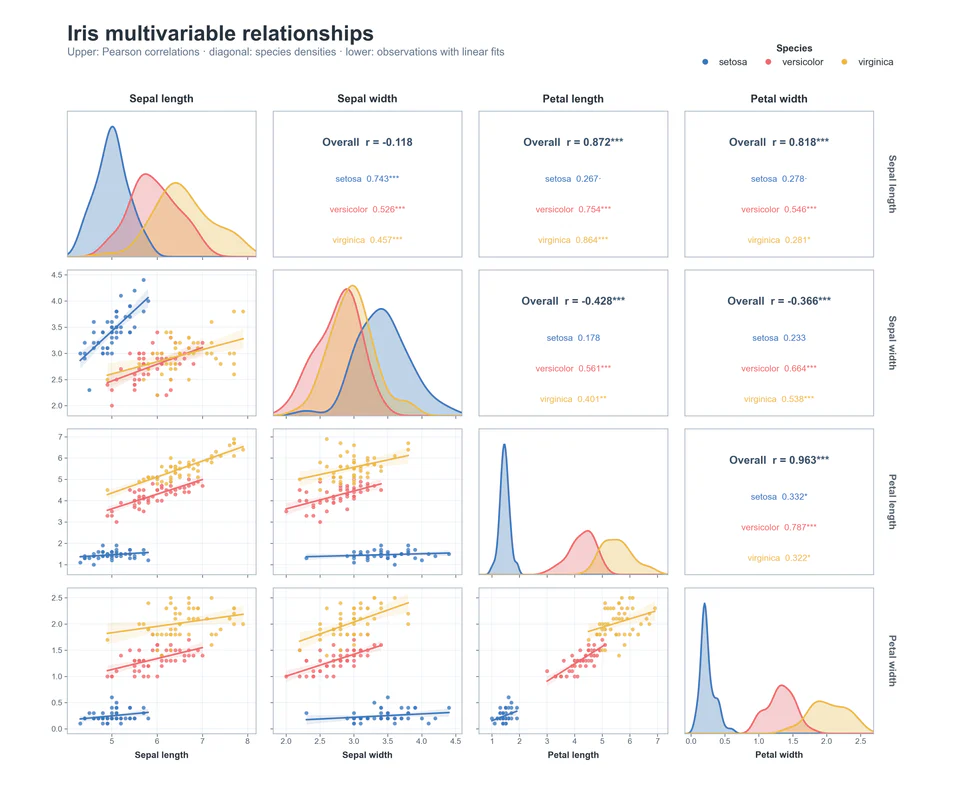</a></td>
    <td width="33%"><a href="skills/academic-figure/templates/rf-0063-clinical-feature-landscape/README.md">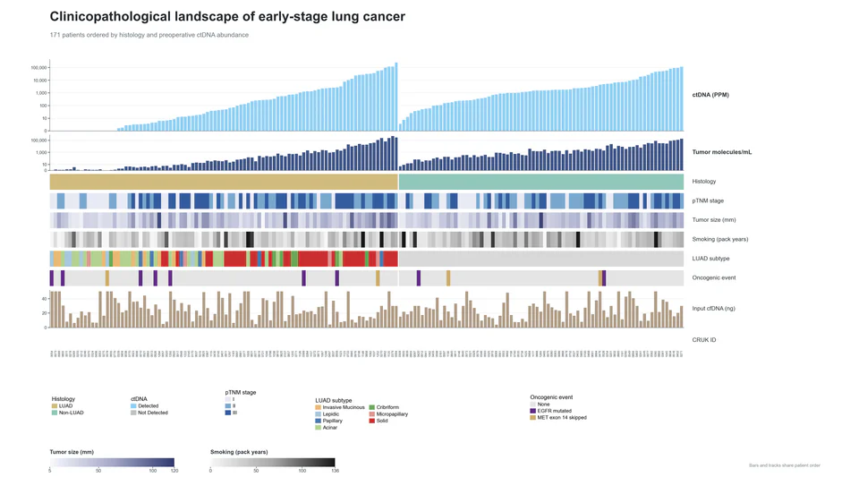</a></td>
    <td width="33%"><a href="skills/academic-figure/templates/rf-0109-benchmark-heatmap/README.md">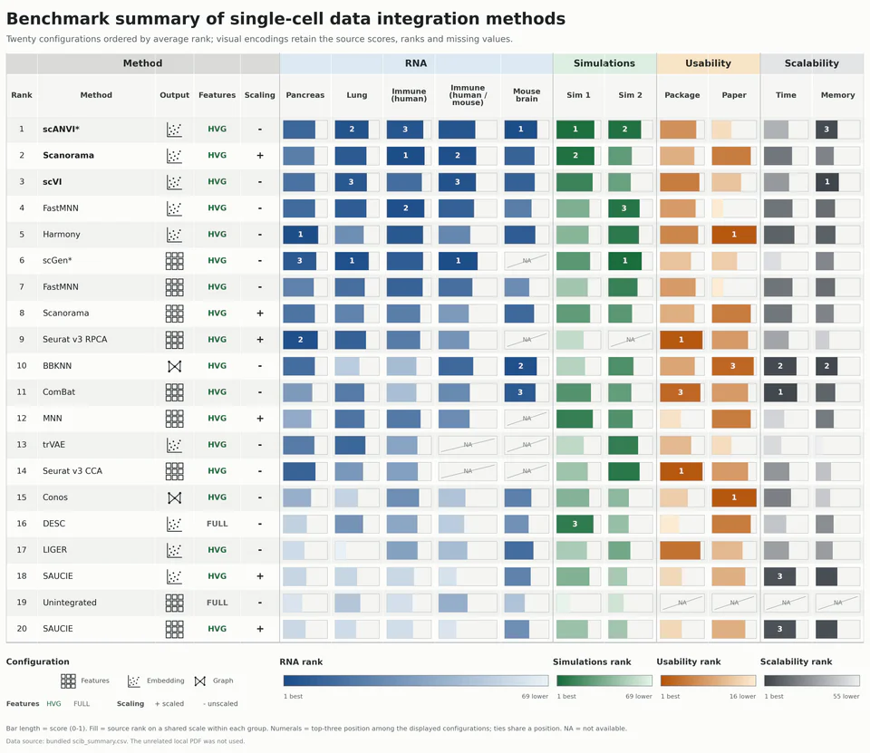</a></td>
  </tr>
  <tr>
    <td><code>rf-0049</code> <strong>多变量比较和相关性分析矩阵图</strong> 开放模板</td>
    <td><code>rf-0063</code> <strong>临床特征热图</strong> 开放模板</td>
    <td><code>rf-0109</code> <strong>Benchmark Ranking Table Heatmap</strong> 开放模板</td>
  </tr>
</table>

<strong>查看“矩阵与模式”全部 27 个案例</strong>

| 案例 | 图形类型 | 开放状态 |
|---|---|---|
| [`rf-0004` · 相关性热图附P值标记](skills/academic-figure/assets/case-atlas/rf-0004-correlation-heatmap/) | 热图与矩阵 | 图鉴案例 |
| [`rf-0011` · 气泡热图](skills/academic-figure/assets/case-atlas/rf-0011-bubble-heatmap/) | 散点与气泡、热图与矩阵 | 图鉴案例 |
| [`rf-0012` · 网络相关性热图](skills/academic-figure/assets/case-atlas/rf-0012-network-correlation-heatmap/) | 热图与矩阵、网络与流向图 | 图鉴案例 |
| [`rf-0013` · 组合热图](skills/academic-figure/assets/case-atlas/rf-0013-combined-heatmap/) | 热图与矩阵 | 图鉴案例 |
| [`rf-0022` · 经典相关性热图](skills/academic-figure/assets/case-atlas/rf-0022-correlation-heatmaps/) | 热图与矩阵 | 图鉴案例 |
| [`rf-0028` · 分组环状热图](skills/academic-figure/assets/case-atlas/rf-0028-grouped-circular-heatmap/) | 热图与矩阵、雷达与极坐标 | 图鉴案例 |
| [`rf-0040` · 分组环状热图](skills/academic-figure/assets/case-atlas/rf-0040-grouped-circular-heatmap/) | 热图与矩阵、雷达与极坐标 | 图鉴案例 |
| [`rf-0042` · 单细胞标志基因表达热图](skills/academic-figure/assets/case-atlas/rf-0042-marker-gene-heatmap/) | 热图与矩阵 | 图鉴案例 |
| [`rf-0049` · 多变量比较和相关性分析矩阵图](skills/academic-figure/templates/rf-0049-relationship-matrix/README.md) | 热图与矩阵 | **Python/R 模板** |
| [`rf-0062` · 彩虹热图](skills/academic-figure/assets/case-atlas/rf-0062-rainbow-heatmap/) | 热图与矩阵 | 图鉴案例 |
| [`rf-0063` · 临床特征热图](skills/academic-figure/templates/rf-0063-clinical-feature-landscape/README.md) | 热图与矩阵 | **Python/R 模板** |
| [`rf-0064` · 带有行和列注释的经典热图](skills/academic-figure/assets/case-atlas/rf-0064-annotated-heatmap/) | 热图与矩阵 | 图鉴案例 |
| [`rf-0073` · 分组环状热图](skills/academic-figure/assets/case-atlas/rf-0073-grouped-circular-heatmap/) | 热图与矩阵、雷达与极坐标 | 图鉴案例 |
| [`rf-0080` · 网络相关性热图](skills/academic-figure/assets/case-atlas/rf-0080-network-correlation-heatmap/) | 热图与矩阵、网络与流向图 | 图鉴案例 |
| [`rf-0096` · Bubble Heatmap](skills/academic-figure/assets/case-atlas/rf-0096-bubble-heatmap/) | 散点与气泡、热图与矩阵 | 图鉴案例 |
| [`rf-0099` · Heatmap Significance Markers](skills/academic-figure/assets/case-atlas/rf-0099-heatmap-significance-markers/) | 热图与矩阵 | 图鉴案例 |
| [`rf-0101` · Correlation Heatmap Marginal Bars](skills/academic-figure/assets/case-atlas/rf-0101-correlation-heatmap-marginal-bars/) | 柱形与棒棒糖、热图与矩阵 | 图鉴案例 |
| [`rf-0102` · Lower Triangular Correlation Heatmap Dendrogram](skills/academic-figure/assets/case-atlas/rf-0102-lower-triangular-correlation-heatmap-dendrogram/) | 热图与矩阵、树与集合图、降维与聚类图 | 图鉴案例 |
| [`rf-0109` · Benchmark Ranking Table Heatmap](skills/academic-figure/templates/rf-0109-benchmark-heatmap/README.md) | 热图与矩阵、表格与流程图 | **Python/R 模板** |
| [`rf-0124` · Circular Heatmap](skills/academic-figure/assets/case-atlas/rf-0124-circular-heatmap/) | 热图与矩阵、雷达与极坐标 | 图鉴案例 |
| [`rf-0127` · Multi Panel Correlation Heatmap](skills/academic-figure/assets/case-atlas/rf-0127-multi-panel-correlation-heatmap/) | 热图与矩阵 | 图鉴案例 |
| [`rf-0149` · Correlation Matrix Dotplots Significance](skills/academic-figure/assets/case-atlas/rf-0149-correlation-matrix-dotplots-significance/) | 热图与矩阵 | 图鉴案例 |
| [`rf-0154` · Faceted Symmetric Heatmaps](skills/academic-figure/assets/case-atlas/rf-0154-faceted-symmetric-heatmaps/) | 热图与矩阵 | 图鉴案例 |
| [`rf-0160` · Dual Triangular Correlation Heatmap](skills/academic-figure/assets/case-atlas/rf-0160-dual-triangular-correlation-heatmap/) | 热图与矩阵 | 图鉴案例 |
| [`rf-0163` · Density Correlation Matrix](skills/academic-figure/assets/case-atlas/rf-0163-density-correlation-matrix/) | 密度与山脊、热图与矩阵 | 图鉴案例 |
| [`rf-0165` · Circular Heatmaps Upset Plots](skills/academic-figure/assets/case-atlas/rf-0165-circular-heatmaps-upset-plots/) | 热图与矩阵、树与集合图、雷达与极坐标 | 图鉴案例 |
| [`rf-0175` · Site Saturation Mutational Energy Heatmap](skills/academic-figure/assets/case-atlas/rf-0175-site-saturation-mutational-energy-heatmap/) | 热图与矩阵 | 图鉴案例 |

## 组成与集合

比例构成、集合交并、多成分约束与组间组成变化，共 **19** 个案例，其中 **3** 个开放模板。

<table role="presentation">
  <tr>
    <td width="33%"><a href="skills/academic-figure/templates/rf-0001-faceted-composition/README.md">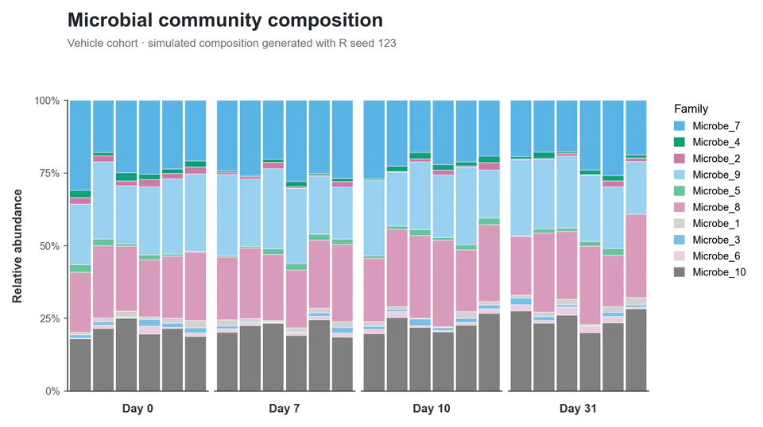</a></td>
    <td width="33%"><a href="skills/academic-figure/templates/rf-0157-upset/README.md">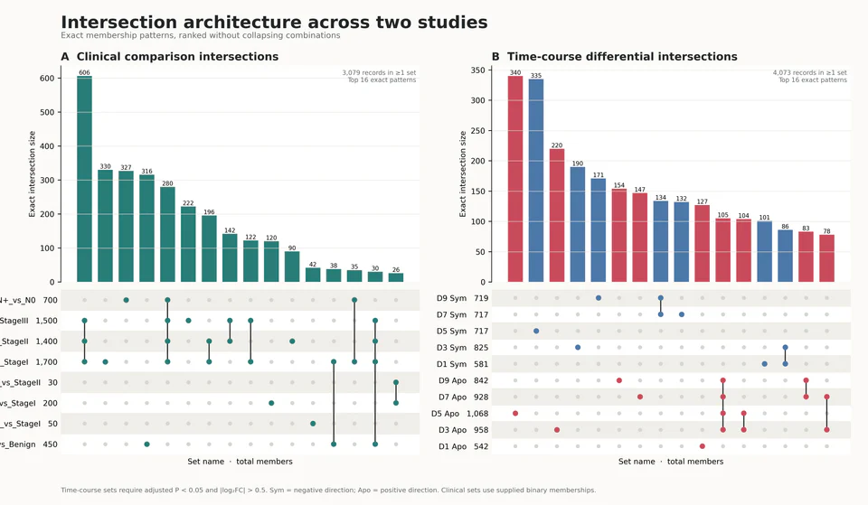</a></td>
    <td width="33%"><a href="skills/academic-figure/templates/rf-0162-ternary-composition/README.md">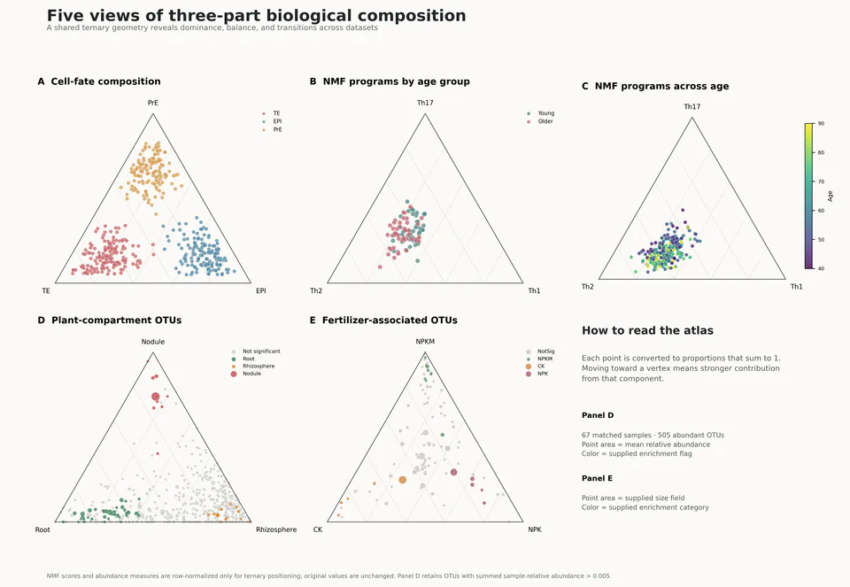</a></td>
  </tr>
  <tr>
    <td><code>rf-0001</code> <strong>分面堆积柱状图</strong> 开放模板</td>
    <td><code>rf-0157</code> <strong>Upset Intersection Plots</strong> 开放模板</td>
    <td><code>rf-0162</code> <strong>Ternary Plots</strong> 开放模板</td>
  </tr>
</table>

<strong>查看“组成与集合”全部 19 个案例</strong>

| 案例 | 图形类型 | 开放状态 |
|---|---|---|
| [`rf-0001` · 分面堆积柱状图](skills/academic-figure/templates/rf-0001-faceted-composition/README.md) | 柱形与棒棒糖 | **Python/R 模板** |
| [`rf-0002` · 径向堆积柱状图](skills/academic-figure/assets/case-atlas/rf-0002-radial-stacked-bar/) | 柱形与棒棒糖、雷达与极坐标 | 图鉴案例 |
| [`rf-0007` · 部分突出显示的饼图](skills/academic-figure/assets/case-atlas/rf-0007-highlighted-pie/) | 饼图与环形 | 图鉴案例 |
| [`rf-0019` · 棒棒糖和甜甜圈图](skills/academic-figure/assets/case-atlas/rf-0019-lollipop-donuts/) | 柱形与棒棒糖、饼图与环形 | 图鉴案例 |
| [`rf-0024` · 分面堆积柱状图](skills/academic-figure/assets/case-atlas/rf-0024-faceted-stacked-bar/) | 柱形与棒棒糖 | 图鉴案例 |
| [`rf-0038` · 各式各样的韦恩图](skills/academic-figure/assets/case-atlas/rf-0038-venn-diagrams/) | 树与集合图 | 图鉴案例 |
| [`rf-0050` · 带有误差棒、坐标轴截断和科学计数法的堆积柱状图](skills/academic-figure/assets/case-atlas/rf-0050-stacked-bar-comparison/) | 柱形与棒棒糖 | 图鉴案例 |
| [`rf-0060` · 三元相图](skills/academic-figure/assets/case-atlas/rf-0060-ternary-state-plot/) | 三元与成分图 | 图鉴案例 |
| [`rf-0067` · 双层嵌套的饼图+甜甜圈图](skills/academic-figure/assets/case-atlas/rf-0067-nested-pie-donut/) | 饼图与环形 | 图鉴案例 |
| [`rf-0070` · 散点饼图](skills/academic-figure/assets/case-atlas/rf-0070-scatter-pie/) | 散点与气泡、饼图与环形 | 图鉴案例 |
| [`rf-0076` · 突变特征图谱](skills/academic-figure/assets/case-atlas/rf-0076-mutational-signature/) | 饼图与环形 | 图鉴案例 |
| [`rf-0086` · 环形柱状图+甜甜圈图](skills/academic-figure/assets/case-atlas/rf-0086-circular-bar-donut/) | 柱形与棒棒糖、饼图与环形、雷达与极坐标 | 图鉴案例 |
| [`rf-0111` · Stacked Bar Dumbbell](skills/academic-figure/assets/case-atlas/rf-0111-stacked-bar-dumbbell/) | 柱形与棒棒糖 | 图鉴案例 |
| [`rf-0116` · Stacked Bar Scatter](skills/academic-figure/assets/case-atlas/rf-0116-stacked-bar-scatter/) | 柱形与棒棒糖、散点与气泡 | 图鉴案例 |
| [`rf-0119` · Faceted Scatter Pie](skills/academic-figure/assets/case-atlas/rf-0119-faceted-scatter-pie/) | 散点与气泡、饼图与环形 | 图鉴案例 |
| [`rf-0157` · Upset Intersection Plots](skills/academic-figure/templates/rf-0157-upset/README.md) | 树与集合图 | **Python/R 模板** |
| [`rf-0162` · Ternary Plots](skills/academic-figure/templates/rf-0162-ternary-composition/README.md) | 三元与成分图 | **Python/R 模板** |
| [`rf-0168` · Circular Bar Pie Chart](skills/academic-figure/assets/case-atlas/rf-0168-circular-bar-pie-chart/) | 柱形与棒棒糖、饼图与环形、雷达与极坐标 | 图鉴案例 |
| [`rf-0174` · Stacked Dot Pie Chart](skills/academic-figure/assets/case-atlas/rf-0174-stacked-dot-pie-chart/) | 饼图与环形 | 图鉴案例 |

## 网络与流向

节点连接、模块结构、传播路径与流量变化，共 **15** 个案例，其中 **2** 个开放模板。

<table role="presentation">
  <tr>
    <td width="33%"><a href="skills/academic-figure/assets/case-atlas/rf-0043-cell-communication-network/">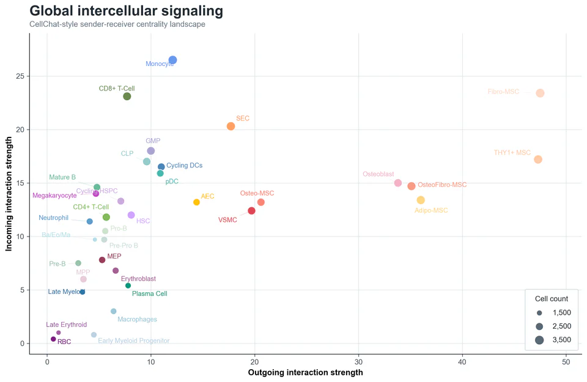</a></td>
    <td width="33%"><a href="skills/academic-figure/templates/rf-0044-clustered-network/README.md">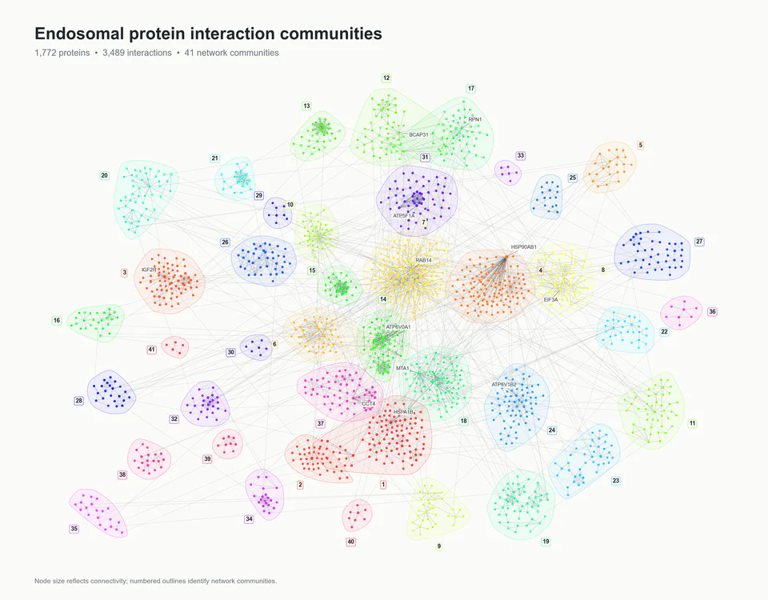</a></td>
    <td width="33%"><a href="skills/academic-figure/templates/rf-0118-sankey/README.md">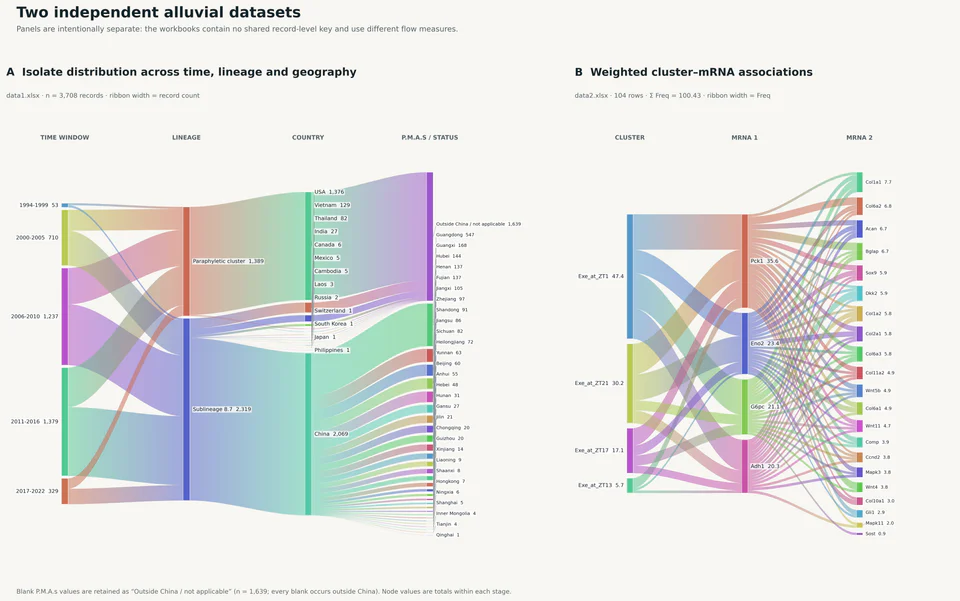</a></td>
  </tr>
  <tr>
    <td><code>rf-0043</code> <strong>细胞通讯网络图</strong> 图鉴案例</td>
    <td><code>rf-0044</code> <strong>聚类网络图</strong> 开放模板</td>
    <td><code>rf-0118</code> <strong>Sankey Diagram</strong> 开放模板</td>
  </tr>
</table>

<strong>查看“网络与流向”全部 15 个案例</strong>

| 案例 | 图形类型 | 开放状态 |
|---|---|---|
| [`rf-0008` · 桑基堆积柱状图](skills/academic-figure/assets/case-atlas/rf-0008-sankey-stacked/) | 网络与流向图 | 图鉴案例 |
| [`rf-0017` · 桑基图](skills/academic-figure/assets/case-atlas/rf-0017-sankey-plot/) | 网络与流向图 | 图鉴案例 |
| [`rf-0023` · 和弦图+UpSet图](skills/academic-figure/assets/case-atlas/rf-0023-upset-chord/) | 网络与流向图、树与集合图 | 图鉴案例 |
| [`rf-0043` · 细胞通讯网络图](skills/academic-figure/assets/case-atlas/rf-0043-cell-communication-network/) | 网络与流向图 | 图鉴案例 |
| [`rf-0044` · 聚类网络图](skills/academic-figure/templates/rf-0044-clustered-network/README.md) | 网络与流向图、降维与聚类图 | **Python/R 模板** |
| [`rf-0046` · 单细胞RNA分析全流程](skills/academic-figure/assets/case-atlas/rf-0046-single-cell-rna-workflow/) | 网络与流向图、表格与流程图 | 图鉴案例 |
| [`rf-0058` · 通路富集网络图](skills/academic-figure/assets/case-atlas/rf-0058-pathway-enrichment-network/) | 网络与流向图、富集分析图 | 图鉴案例 |
| [`rf-0069` · 花瓣网络图](skills/academic-figure/assets/case-atlas/rf-0069-petal-network/) | 柱形与棒棒糖、网络与流向图 | 图鉴案例 |
| [`rf-0075` · 传播流向扩散地图](skills/academic-figure/assets/case-atlas/rf-0075-flow-diffusion-map/) | 网络与流向图 | 图鉴案例 |
| [`rf-0081` · 桑基气泡图](skills/academic-figure/assets/case-atlas/rf-0081-sankey-bubble-plot/) | 散点与气泡、网络与流向图 | 图鉴案例 |
| [`rf-0106` · Grouped Chord Outer Bars](skills/academic-figure/assets/case-atlas/rf-0106-grouped-chord-outer-bars/) | 柱形与棒棒糖、网络与流向图 | 图鉴案例 |
| [`rf-0113` · Circos Gene List Overlap Shared Gene Network](skills/academic-figure/assets/case-atlas/rf-0113-circos-gene-list-overlap-shared-gene-network/) | 网络与流向图、雷达与极坐标 | 图鉴案例 |
| [`rf-0118` · Sankey Diagram](skills/academic-figure/templates/rf-0118-sankey/README.md) | 网络与流向图 | **Python/R 模板** |
| [`rf-0126` · Network Bar Plot](skills/academic-figure/assets/case-atlas/rf-0126-network-bar-plot/) | 柱形与棒棒糖、网络与流向图 | 图鉴案例 |
| [`rf-0146` · Alluvial Back To Back Stacked Bars](skills/academic-figure/assets/case-atlas/rf-0146-alluvial-back-to-back-stacked-bars/) | 柱形与棒棒糖、网络与流向图 | 图鉴案例 |

## 空间与层级

地理分布、空间分区、嵌套结构与层级关系，共 **13** 个案例，其中 **2** 个开放模板。

<table role="presentation">
  <tr>
    <td width="33%"><a href="skills/academic-figure/assets/case-atlas/rf-0055-voronoi-treemap/">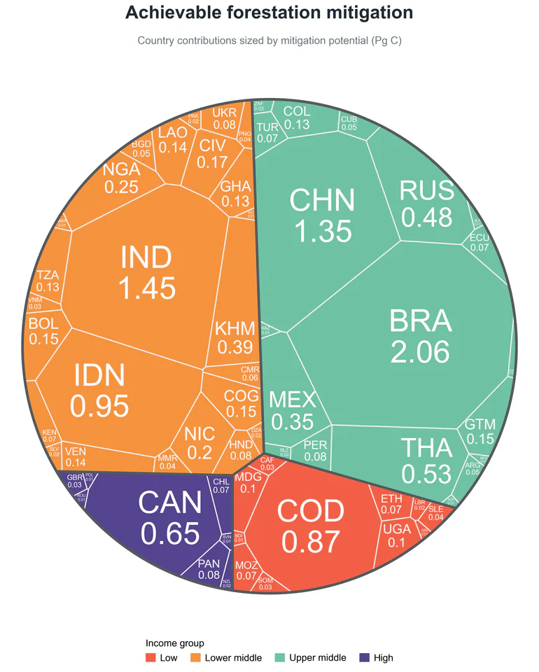</a></td>
    <td width="33%"></td>
    <td width="33%"><a href="skills/academic-figure/templates/rf-0122-spatial-composition-map/README.md">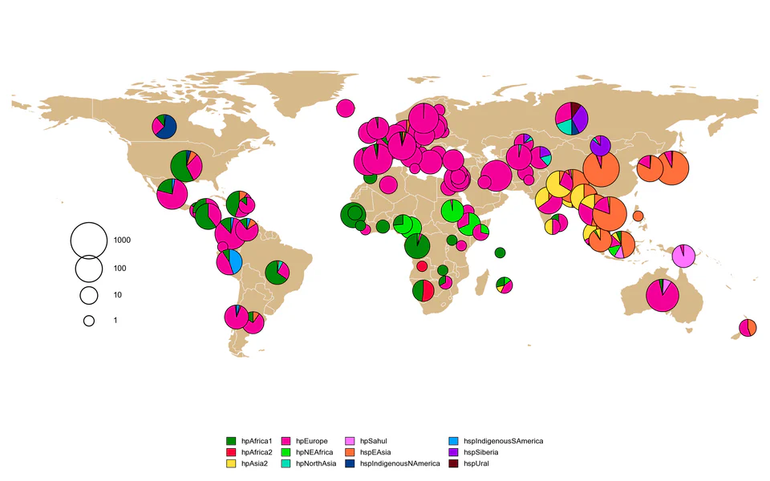</a></td>
  </tr>
  <tr>
    <td><code>rf-0055</code> <strong>沃罗诺伊树图</strong> 图鉴案例</td>
    <td><code>rf-0066</code> <strong>旭日图</strong> 开放模板</td>
    <td><code>rf-0122</code> <strong>Sample Geographic Distribution Maps</strong> 开放模板</td>
  </tr>
</table>

<strong>查看“空间与层级”全部 13 个案例</strong>

| 案例 | 图形类型 | 开放状态 |
|---|---|---|
| [`rf-0010` · 组织器官解剖图](skills/academic-figure/assets/case-atlas/rf-0010-anatomy-atlas/) | 地图与空间图 | 图鉴案例 |
| [`rf-0037` · 惠特克生物群系图](skills/academic-figure/assets/case-atlas/rf-0037-whittaker-biomes-plot/) | 地图与空间图 | 图鉴案例 |
| [`rf-0051` · 三维散点图](skills/academic-figure/assets/case-atlas/rf-0051-fiji-earthquakes-3d/) | 地图与空间图 | 图鉴案例 |
| [`rf-0053` · 气泡网络地图](skills/academic-figure/assets/case-atlas/rf-0053-bubble-network-map/) | 散点与气泡、网络与流向图 | 图鉴案例 |
| [`rf-0055` · 沃罗诺伊树图](skills/academic-figure/assets/case-atlas/rf-0055-voronoi-treemap/) | 树与集合图、地图与空间图 | 图鉴案例 |
| [`rf-0057` · 带复杂注释的系统发育树](skills/academic-figure/assets/case-atlas/rf-0057-annotated-phylogenetic-tree/) | 树与集合图 | 图鉴案例 |
| [`rf-0059` · 差异甲基化（DMR）染色体分布图](skills/academic-figure/assets/case-atlas/rf-0059-dmr-chromosome-plots/) | 火山与曼哈顿 | 图鉴案例 |
| [`rf-0066` · 旭日图](skills/academic-figure/templates/rf-0066-hierarchy-sunburst/README.md) | 树与集合图 | **Python/R 模板** |
| [`rf-0077` · 沃罗诺伊图](skills/academic-figure/assets/case-atlas/rf-0077-voronoi-treemap/) | 树与集合图、地图与空间图 | 图鉴案例 |
| [`rf-0079` · 圆形堆积图](skills/academic-figure/assets/case-atlas/rf-0079-circle-pack-plot/) | 树与集合图 | 图鉴案例 |
| [`rf-0097` · Phylogenetic Tree Outer Heatmap Bars](skills/academic-figure/assets/case-atlas/rf-0097-phylogenetic-tree-outer-heatmap-bars/) | 柱形与棒棒糖、热图与矩阵、树与集合图 | 图鉴案例 |
| [`rf-0122` · Sample Geographic Distribution Maps](skills/academic-figure/templates/rf-0122-spatial-composition-map/README.md) | 地图与空间图 | **Python/R 模板** |
| [`rf-0159` · China Spatial Maps](skills/academic-figure/assets/case-atlas/rf-0159-china-spatial-maps/) | 地图与空间图 | 图鉴案例 |

## 时间与过程

生存、时间序列、事件轨迹与个体过程，共 **11** 个案例，其中 **2** 个开放模板。

<table role="presentation">
  <tr>
    <td width="33%"><a href="skills/academic-figure/templates/rf-0018-survival-risk-table/README.md">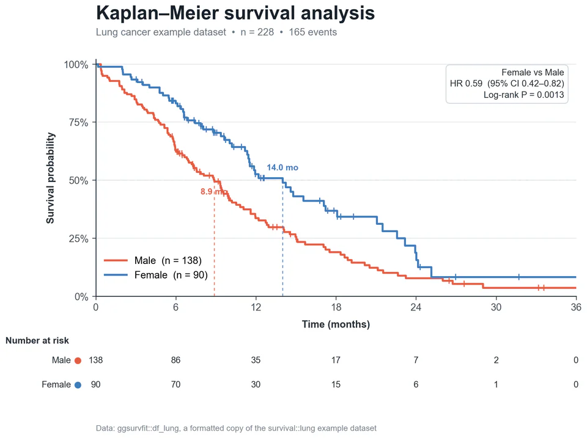</a></td>
    <td width="33%"><a href="skills/academic-figure/templates/rf-0026-subject-timeline/README.md">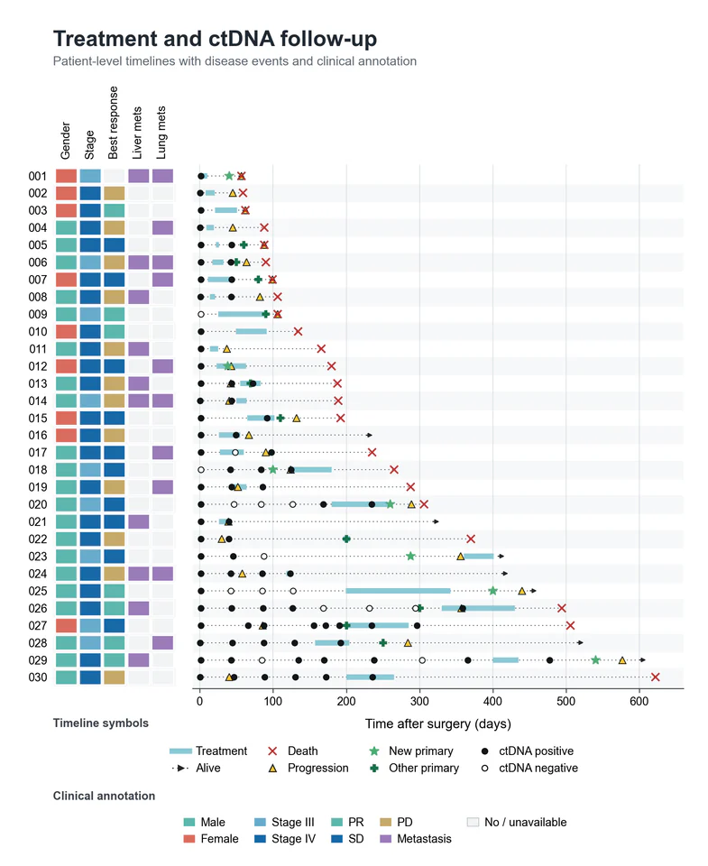</a></td>
    <td width="33%"><a href="skills/academic-figure/assets/case-atlas/rf-0061-immune-time-series/">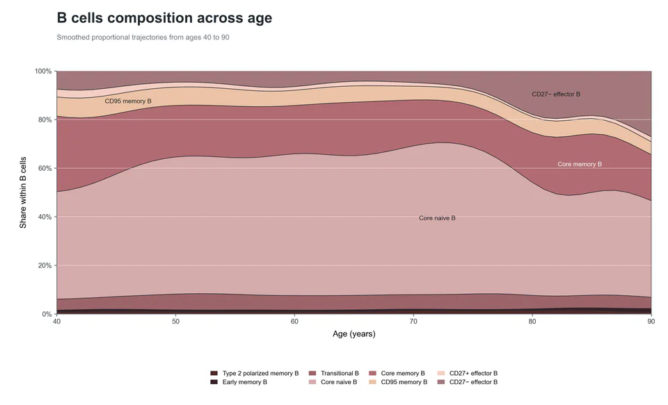</a></td>
  </tr>
  <tr>
    <td><code>rf-0018</code> <strong>生存曲线</strong> 开放模板</td>
    <td><code>rf-0026</code> <strong>泳道图</strong> 开放模板</td>
    <td><code>rf-0061</code> <strong>时间序列折线图+流线图+拟合曲线图</strong> 图鉴案例</td>
  </tr>
</table>

<strong>查看“时间与过程”全部 11 个案例</strong>

| 案例 | 图形类型 | 开放状态 |
|---|---|---|
| [`rf-0018` · 生存曲线](skills/academic-figure/templates/rf-0018-survival-risk-table/README.md) | 森林与生存图 | **Python/R 模板** |
| [`rf-0026` · 泳道图](skills/academic-figure/templates/rf-0026-subject-timeline/README.md) | 折线与曲线 | **Python/R 模板** |
| [`rf-0035` · 泳道图](skills/academic-figure/assets/case-atlas/rf-0035-swimmer-plot/) | 折线与曲线 | 图鉴案例 |
| [`rf-0048` · 带注释的泳道图+瀑布图](skills/academic-figure/assets/case-atlas/rf-0048-annotated-response-plots/) | 折线与曲线、柱形与棒棒糖 | 图鉴案例 |
| [`rf-0061` · 时间序列折线图+流线图+拟合曲线图](skills/academic-figure/assets/case-atlas/rf-0061-immune-time-series/) | 折线与曲线 | 图鉴案例 |
| [`rf-0065` · 泳道图](skills/academic-figure/assets/case-atlas/rf-0065-swimmer-plot/) | 折线与曲线 | 图鉴案例 |
| [`rf-0074` · 时间序列堆叠面积图](skills/academic-figure/assets/case-atlas/rf-0074-stacked-area-timeseries/) | 折线与曲线 | 图鉴案例 |
| [`rf-0078` · 单细胞分化轨迹图](skills/academic-figure/assets/case-atlas/rf-0078-single-cell-trajectory/) | 折线与曲线 | 图鉴案例 |
| [`rf-0129` · Curve Smoothing Three Methods](skills/academic-figure/assets/case-atlas/rf-0129-curve-smoothing-three-methods/) | 折线与曲线 | 图鉴案例 |
| [`rf-0139` · Multi Panel Time Series Plots](skills/academic-figure/assets/case-atlas/rf-0139-multi-panel-time-series-plots/) | 折线与曲线 | 图鉴案例 |
| [`rf-0171` · Patient Swimmer Plots](skills/academic-figure/assets/case-atlas/rf-0171-patient-swimmer-plots/) | 折线与曲线 | 图鉴案例 |

## 降维与聚类

低维嵌入、群落差异、聚类结果与模块注释，共 **11** 个案例，其中 **3** 个开放模板。

<table role="presentation">
  <tr>
    <td width="33%"><a href="skills/academic-figure/templates/rf-0041-embedding-composition/README.md">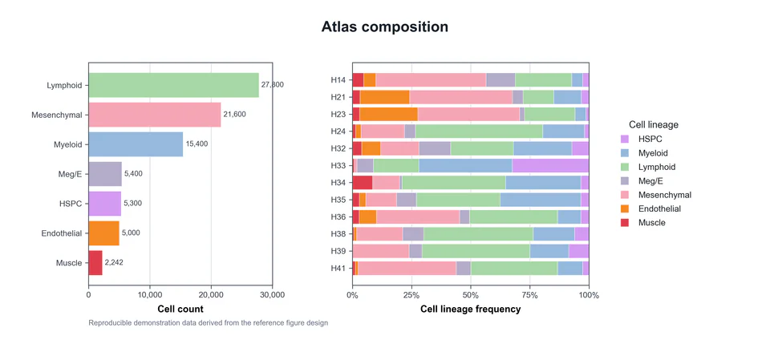</a></td>
    <td width="33%"><a href="skills/academic-figure/templates/rf-0054-clustered-matrix-enrichment/README.md">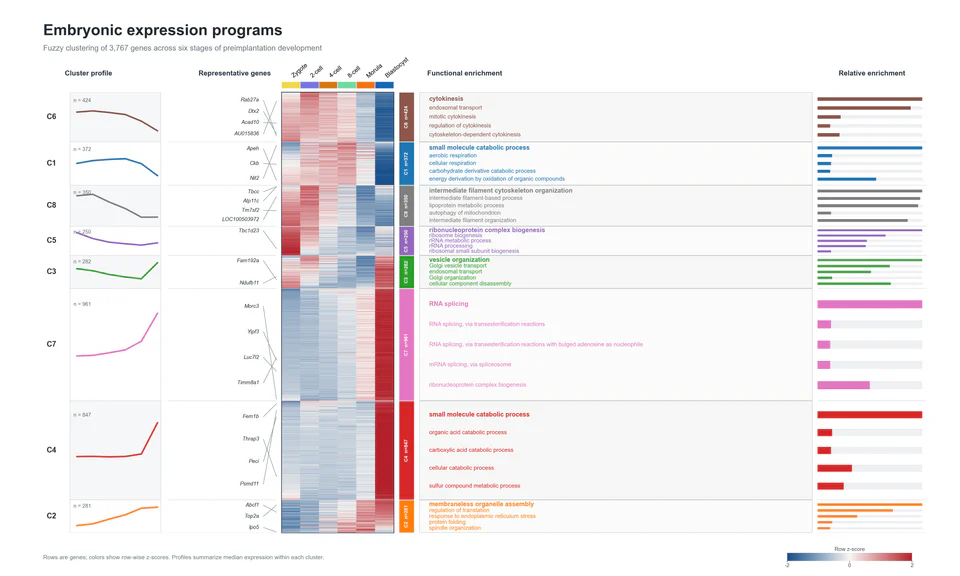</a></td>
    <td width="33%"><a href="skills/academic-figure/templates/rf-0091-ordination/README.md">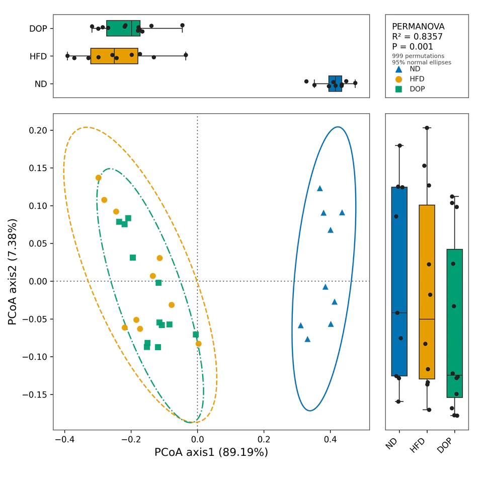</a></td>
  </tr>
  <tr>
    <td><code>rf-0041</code> <strong>单细胞UMAP+细胞占比图</strong> 开放模板</td>
    <td><code>rf-0054</code> <strong>基因聚类富集注释热图</strong> 开放模板</td>
    <td><code>rf-0091</code> <strong>PCOA Marginal Boxplots Permanova</strong> 开放模板</td>
  </tr>
</table>

<strong>查看“降维与聚类”全部 11 个案例</strong>

| 案例 | 图形类型 | 开放状态 |
|---|---|---|
| [`rf-0025` · 带聚类树的气泡热图](skills/academic-figure/assets/case-atlas/rf-0025-clustered-bubble-heatmap/) | 散点与气泡、热图与矩阵、降维与聚类图 | 图鉴案例 |
| [`rf-0041` · 单细胞UMAP+细胞占比图](skills/academic-figure/templates/rf-0041-embedding-composition/README.md) | 降维与聚类图 | **Python/R 模板** |
| [`rf-0045` · CytoTRACE细胞分化潜能图](skills/academic-figure/assets/case-atlas/rf-0045-cytotrace-potential/) | 降维与聚类图 | 图鉴案例 |
| [`rf-0047` · 星云图](skills/academic-figure/assets/case-atlas/rf-0047-galaxy-plot/) | 降维与聚类图 | 图鉴案例 |
| [`rf-0054` · 基因聚类富集注释热图](skills/academic-figure/templates/rf-0054-clustered-matrix-enrichment/README.md) | 热图与矩阵、降维与聚类图、富集分析图 | **Python/R 模板** |
| [`rf-0085` · 带聚类树的堆积柱状图](skills/academic-figure/assets/case-atlas/rf-0085-dendrogram-stacked-bar/) | 柱形与棒棒糖、树与集合图、降维与聚类图 | 图鉴案例 |
| [`rf-0091` · PCOA Marginal Boxplots Permanova](skills/academic-figure/templates/rf-0091-ordination/README.md) | 箱线与小提琴、降维与聚类图 | **Python/R 模板** |
| [`rf-0140` · Violin Plots Nmds Ordination](skills/academic-figure/assets/case-atlas/rf-0140-violin-plots-nmds-ordination/) | 箱线与小提琴、降维与聚类图 | 图鉴案例 |
| [`rf-0142` · PCOA Multigroup Marginals](skills/academic-figure/assets/case-atlas/rf-0142-pcoa-multigroup-marginals/) | 降维与聚类图 | 图鉴案例 |
| [`rf-0167` · UMAP Concentric Group Annotations](skills/academic-figure/assets/case-atlas/rf-0167-umap-concentric-group-annotations/) | 降维与聚类图 | 图鉴案例 |
| [`rf-0176` · T Lymphocyte Subtype UMAP](skills/academic-figure/assets/case-atlas/rf-0176-t-lymphocyte-subtype-umap/) | 降维与聚类图 | 图鉴案例 |

## 如何使用图鉴

1. 先明确研究问题、观察单位、变量角色和统计口径。
2. 按表达目标选择类别，再用案例编号、标题或关键词缩小范围。
3. 判断案例属于 `exact`、`structural`、`style-only` 还是需要新设计。
4. 只有标记为“Python/R 模板”的案例包含开放实现；其余案例由 Skill 提取通用信息结构，不复制私有源码。

本图鉴由 [公开案例索引](skills/academic-figure/references/cases/case-index.jsonl) 生成。
