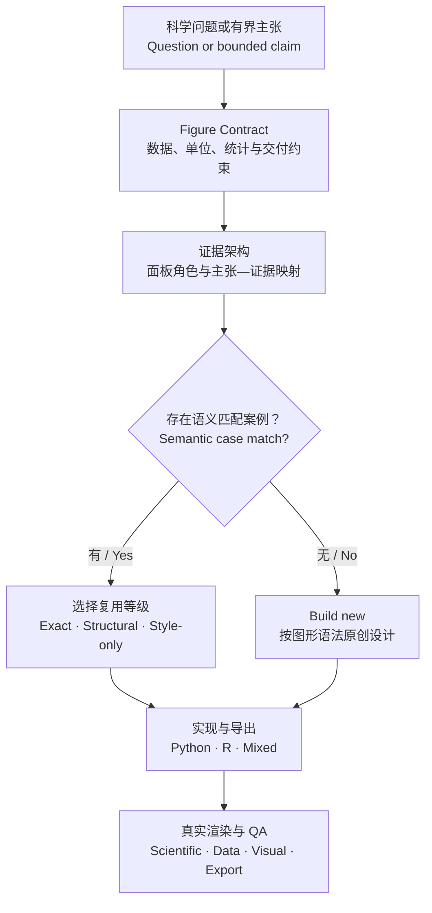

<div align="center">

# SciPlot｜科研绘图

**先设计科学论证，再选择图形。**<br>
*Design the evidence before the chart.*

一个面向 Codex 的科研绘图 Agent Skill：从科学问题、数据结构与统计语义出发，创建、修改和审查可复现的论文级图件。

<p>
  <a href="https://github.com/HailCodeMaster/sci-plot/actions/workflows/validate.yml"></a>
  <a href="LICENSE"></a>
  <a href="skills/sci-plot/SKILL.md"></a>
  <a href="skills/sci-plot/references/case-index.md"></a>
</p>

<a href="#install"><strong>30 秒安装</strong></a>
·
<a href="#gallery"><strong>18 案例图谱</strong></a>
·
<a href="#workflow"><strong>工作方式</strong></a>
·
<a href="#examples"><strong>调用示例</strong></a>
·
<a href="#english"><strong>English</strong></a>

</div>

> [!IMPORTANT]
> **案例不是模板，也不是能力边界。** SciPlot 会先完成 Figure Contract 与证据架构，再把案例当作可选设计先验；没有语义匹配时，明确选择 `build-new`，继续原创设计。

| **18** 个设计案例 | **6** 张风险卡 | **4** 种复用等级 | **5** 层完成度检查 |
|:---:|:---:|:---:|:---:|
| 科学表达决策 | 常见失败模式 | 从精确复用到重新设计 | 代码、运行、文件、视觉、科学 |

## 为什么是 SciPlot

科研图不是装饰过的数据容器，而是一条可以被检查的视觉论证：

`问题或主张 → 证据 → 面板角色 → 视觉编码 → 渲染图件`

| 常见起点 | SciPlot 的起点 |
|---|---|
| “这组数据适合画什么图？” | “读者需要用什么证据判断这个主张？” |
| 先找一张外观相近的图 | 先明确分析单位、重复单位、数据结构和推断边界 |
| 复用版式时顺带迁移统计逻辑 | 案例只在语义兼容时复用，并显式选择复用等级 |
| 图导出成功就算完成 | 分别验证代码、运行、文件、视觉质量和科学有效性 |
| 缺少案例就停止或强行匹配 | 返回 `no suitable case`，转入原则驱动的原创设计 |

SciPlot 支持三条任务路线：

- **Create**：从数据、结果或研究问题创建新图件。
- **Revise**：在不静默改变科学含义的前提下修改现有图或代码。
- **Review**：只读审查统计语义、数据完整性、视觉表达、复现性和导出质量。

<a id="install"></a>

## 30 秒安装

在 Codex 中粘贴：

```text
请使用 $skill-installer 安装：
https://github.com/HailCodeMaster/sci-plot/tree/main/skills/sci-plot
```

安装后用 `$sci-plot` 显式调用。Codex 通常会自动检测新 skill；如果没有出现，请重启 Codex。

<details>
<summary><strong>手动安装 / Manual installation</strong></summary>

```bash
git clone https://github.com/HailCodeMaster/sci-plot.git
mkdir -p "$HOME/.agents/skills"
cp -R sci-plot/skills/sci-plot "$HOME/.agents/skills/sci-plot"
```

也可以复制到项目的 `.agents/skills/sci-plot/`，使它只在当前仓库范围内生效。参见 OpenAI 的 [Build skills](https://developers.openai.com/plugins/build/skills)。

</details>

<a id="gallery"></a>

## 18 个科学表达决策

这不是“18 种图表类型”，而是 18 种需要做对的科学表达决策。点击图片可查看原尺寸。

- **A · AUDITED**：表达逻辑已审计；迁移时仍须重做当前数据的统计与验证。
- **B · CONDITIONAL**：可作为设计先验，但必须满足卡片列出的条件。
- **C · REFERENCE ONLY**：用于识别问题与风险，当前不作为直接实现模板。

### 01｜观测与效应估计 · Observation & estimation

<table role="presentation">
  <tr>
    <td width="33%" valign="top">
      <a href="skills/sci-plot/assets/cases/rf-0104.webp"></a><br>
      <strong><code>rf-0104</code> 让分布与原始观测同场</strong><br>
      <sub>Core · Distribution + raw observations<br><strong>B · CONDITIONAL</strong></sub>
    </td>
    <td width="33%" valign="top">
      <a href="skills/sci-plot/assets/cases/rf-0173.webp"></a><br>
      <strong><code>rf-0173</code> 保留每个对象的配对变化</strong><br>
      <sub>Core · Paired change + missingness<br><strong>C · REFERENCE ONLY</strong></sub>
    </td>
    <td width="33%" valign="top">
      <a href="skills/sci-plot/assets/cases/rf-0088.webp"></a><br>
      <strong><code>rf-0088</code> 对齐效应量、区间与变量</strong><br>
      <sub>Core · Effect estimates + covariate table<br><strong>B · CONDITIONAL</strong></sub>
    </td>
  </tr>
</table>

### 02｜关系、模型与结构 · Relationship, model & structure

<table role="presentation">
  <tr>
    <td width="33%" valign="top">
      <a href="skills/sci-plot/assets/cases/rf-0178.webp"></a><br>
      <strong><code>rf-0178</code> 让拟合与残差共同作证</strong><br>
      <sub>Core · Fit + marginals + diagnostics<br><strong>A · AUDITED</strong></sub>
    </td>
    <td width="33%" valign="top">
      <a href="skills/sci-plot/assets/cases/rf-0180.webp"></a><br>
      <strong><code>rf-0180</code> 保留双轴非对称不确定性</strong><br>
      <sub>Core · Bivariate measurement uncertainty<br><strong>B · CONDITIONAL</strong></sub>
    </td>
    <td width="33%" valign="top">
      <a href="skills/sci-plot/assets/cases/rf-0102.webp"></a><br>
      <strong><code>rf-0102</code> 绑定相关结构与聚类决策</strong><br>
      <sub>Core · Correlation + hierarchical clustering<br><strong>B · CONDITIONAL</strong></sub>
    </td>
  </tr>
</table>

### 03｜时间与过程 · Time & process

<table role="presentation">
  <tr>
    <td width="33%" valign="top">
      <a href="skills/sci-plot/assets/cases/rf-0018.webp"></a><br>
      <strong><code>rf-0018</code> 联读生存、删失与在险人数</strong><br>
      <sub>Core · Survival + censoring + risk table<br><strong>A · AUDITED</strong></sub>
    </td>
    <td width="33%" valign="top">
      <a href="skills/sci-plot/assets/cases/rf-0061.webp"></a><br>
      <strong><code>rf-0061</code> 兼顾个体轨迹与组级趋势</strong><br>
      <sub>Core · Longitudinal individual + group dynamics<br><strong>B · BACKEND-SPECIFIC</strong></sub>
    </td>
    <td width="33%" valign="top">
      <a href="skills/sci-plot/assets/cases/rf-0035.webp"></a><br>
      <strong><code>rf-0035</code> 沿时间轴呈现对象历程</strong><br>
      <sub>Extension · Timelines + discrete events<br><strong>B · CONDITIONAL</strong></sub>
    </td>
  </tr>
</table>

### 04｜组成、集合与流向 · Composition, sets & flow

<table role="presentation">
  <tr>
    <td width="33%" valign="top">
      <a href="skills/sci-plot/assets/cases/rf-0001.webp"></a><br>
      <strong><code>rf-0001</code> 在共同分母下比较组成</strong><br>
      <sub>Core · Composition under a common denominator<br><strong>A · AUDITED</strong></sub>
    </td>
    <td width="33%" valign="top">
      <a href="skills/sci-plot/assets/cases/rf-0157.webp"></a><br>
      <strong><code>rf-0157</code> 区分精确交集与集合规模</strong><br>
      <sub>Core · Exact intersections + set sizes<br><strong>C · REFERENCE ONLY</strong></sub>
    </td>
    <td width="33%" valign="top">
      <a href="skills/sci-plot/assets/cases/rf-0118.webp"></a><br>
      <strong><code>rf-0118</code> 明确多阶段流带的带宽语义</strong><br>
      <sub>Extension · Multi-stage flow + width semantics<br><strong>B · NEEDS REVIEW</strong></sub>
    </td>
  </tr>
</table>

### 05｜多组学与高维结构 · Multi-omics & high-dimensional structure

<table role="presentation">
  <tr>
    <td width="33%" valign="top">
      <a href="skills/sci-plot/assets/cases/rf-0107.webp"></a><br>
      <strong><code>rf-0107</code> 连接特征差异与通路富集</strong><br>
      <sub>Core · Feature differences → pathway enrichment<br><strong>B · CONDITIONAL</strong></sub>
    </td>
    <td width="33%" valign="top">
      <a href="skills/sci-plot/assets/cases/rf-0054.webp"></a><br>
      <strong><code>rf-0054</code> 对齐模块模式与功能注释</strong><br>
      <sub>Extension · Cluster pattern + functional annotation<br><strong>B · UPSTREAM-FROZEN</strong></sub>
    </td>
    <td width="33%" valign="top">
      <a href="skills/sci-plot/assets/cases/rf-0176.webp"></a><br>
      <strong><code>rf-0176</code> 只展示已计算的低维坐标</strong><br>
      <sub>Extension · Precomputed embedding<br><strong>B · DISPLAY-ONLY</strong></sub>
    </td>
  </tr>
</table>

### 06｜多源证据整合 · Multi-source evidence integration

<table role="presentation">
  <tr>
    <td width="33%" valign="top">
      <a href="skills/sci-plot/assets/cases/rf-0109.webp"></a><br>
      <strong><code>rf-0109</code> 让排名、分数与缺失对齐</strong><br>
      <sub>Core · Ranking + scores + missingness + settings<br><strong>A · AUDITED</strong></sub>
    </td>
    <td width="33%" valign="top">
      <a href="skills/sci-plot/assets/cases/rf-0063.webp"></a><br>
      <strong><code>rf-0063</code> 让临床轨道共享患者顺序</strong><br>
      <sub>Extension · Patient-aligned heterogeneous tracks<br><strong>B · CONDITIONAL</strong></sub>
    </td>
    <td width="33%" valign="top">
      <a href="skills/sci-plot/assets/cases/rf-0159.webp"></a><br>
      <strong><code>rf-0159</code> 以空间契约约束地图表达</strong><br>
      <sub>Extension · CRS + boundary version + spatial values<br><strong>B · SPATIAL-CONTRACT</strong></sub>
    </td>
  </tr>
</table>

完整的机器索引见 [`case-index.json`](skills/sci-plot/references/case-index.json)，设计卡见 [`cases-core.md`](skills/sci-plot/references/cases-core.md) 与 [`cases-extensions.md`](skills/sci-plot/references/cases-extensions.md)。案例素材的原创复现与公开边界见 [`CASE_ASSETS.md`](CASE_ASSETS.md)。

### 案例复用只允许四种等级

| 等级 | 何时使用 | 必须重做什么 |
|---|---|---|
| **Exact reuse** | 科学语义、维度、变换和输入契约均兼容 | 当前数据的数值、统计、图注与 QA |
| **Structural adaptation** | 证据逻辑相同，但字段或单位不同 | 字段、单位、顺序、重复单位与统计映射 |
| **Style-only inheritance** | 只需要视觉语言或注释语法 | 全部数据与统计逻辑 |
| **Build new** | 问题、结构或推断假设不同，或没有合适案例 | 从 Figure Contract 与图形语法重新设计 |

<a id="workflow"></a>

## 工作方式



Figure Contract 会在选版式前固定最容易被图形悄悄改变的内容：科学问题、分析单位、重复单位、样本量定义、单位、中心与不确定性、检验或模型、过滤与变换，以及最终尺寸和格式。

<a id="examples"></a>

## 调用示例

| 目标 | 可以直接交给 Codex 的提示 |
|---|---|
| **创建主图** | `$sci-plot 根据这份数据和研究问题设计一张论文主图，输出可编辑 SVG、预览图、Figure Contract 和 QA 结果。` |
| **重构多面板图** | `$sci-plot 在不改变统计含义的前提下重构这个多面板图，并记录前后差异。` |
| **只读审查** | `$sci-plot 审查这张图的数据完整性、统计语义、视觉诚实性、可读性和导出质量；先不要修改文件。` |
| **无案例原创设计** | `$sci-plot 不要求匹配现有案例；请从科学问题和数据结构出发原创设计，并说明每个面板的证据角色。` |

## 交付不是一张“看起来完成”的图

Create 或 Revise 路线默认要求：

- 可运行的 Python、R 或明确记录的混合工作流；
- 可编辑的主图件（适合时优先 SVG/PDF）与审阅预览；
- 完整或更新后的 Figure Contract；
- 过滤、变换、聚合、统计、案例影响和后端来源记录；
- 在目标物理尺寸下完成的 QA 结果与未解决限制。

Review 路线保持只读，按科学含义、数据完整性、统计语义、视觉沟通、可复现性和导出质量分组报告问题，并为每个可操作问题给出严重程度、证据和范围明确的修复建议。

## 风险卡与完成度

[`risk-cards.md`](skills/sci-plot/references/risk-cards.md) 目前覆盖 6 类常见失败模式，包括不完整的误差棒与星号语义、数值范围与标签冲突、按结果排序制造趋势、模拟嵌入替代真实坐标、案例阈值冒充通用统计规则，以及“脚本运行成功但图仍然错误”。

SciPlot 明确区分：

1. 代码能否通过基础检查；
2. 脚本能否实际运行；
3. 导出文件是否有效；
4. 图件在目标尺寸下是否清晰；
5. 科学含义与数据映射是否正确。

任何一层都不能替代其他层。

## 仓库结构

```text
skills/sci-plot/
├── SKILL.md
├── agents/openai.yaml
├── assets/cases/
├── references/
└── scripts/
```

- [`SKILL.md`](skills/sci-plot/SKILL.md)：主工作流、触发范围和交付要求。
- [`references/`](skills/sci-plot/references/)：Figure Contract、图形语法、数据完整性、案例卡、风险卡与 QA。
- [`rank_cases.py`](skills/sci-plot/scripts/rank_cases.py)：按科学语义检索候选案例，允许无匹配结果。
- [`validate_contract.py`](skills/sci-plot/scripts/validate_contract.py)：检查序列化 Figure Contract 的关键约束。

### 本地验证

```bash
python3 skills/sci-plot/scripts/rank_cases.py --validate-only
python3 skills/sci-plot/scripts/validate_contract.py \
  skills/sci-plot/references/figure-contract.example.json \
  --pretty
```

预期结果分别包含 `valid: 18 cases` 和 `PASS`。仓库的 GitHub Actions 会在每次 push 和 pull request 时执行同类检查。

## 参与建设

欢迎通过 [Issues](https://github.com/HailCodeMaster/sci-plot/issues) 或 Pull Requests 提交：

- 新的科学表达决策案例；
- 会导致误读或统计失真的风险卡；
- Python / R 后端适配和导出改进；
- 可访问性、字体、颜色和期刊尺寸 QA；
- Figure Contract 与案例检索机制的改进。

新增案例必须说明它代表的**科学表达决策**、适用数据结构、禁用条件和证据边界；只有外观新颖不足以进入案例库。

## 许可与边界

本项目以 [Apache-2.0](LICENSE) 发布，许可文本同时保留在仓库根目录和可安装的 skill 目录中。

> [!NOTE]
> SciPlot 是独立社区项目，与 Nature、Springer Nature 或任何期刊没有隶属或官方合作关系。“Nature-style”在本项目中仅表示克制、证据导向的出版级设计。生成的图形、引用、统计结论和实验描述仍须由研究者核验。

<a id="english"></a>

<details>
<summary><strong>English quick start</strong></summary>

SciPlot is a Codex Agent Skill for designing, revising, and auditing publication-ready scientific figures from the scientific question, data structure, and statistical meaning.

Ask Codex to install it:

```text
Use $skill-installer to install:
https://github.com/HailCodeMaster/sci-plot/tree/main/skills/sci-plot
```

Then invoke it with `$sci-plot`.

Its central rule is simple: cases are optional design priors, not templates or capability limits. When no case is semantically compatible, SciPlot records `build-new` and continues from the Figure Contract and figure grammar.

</details>
