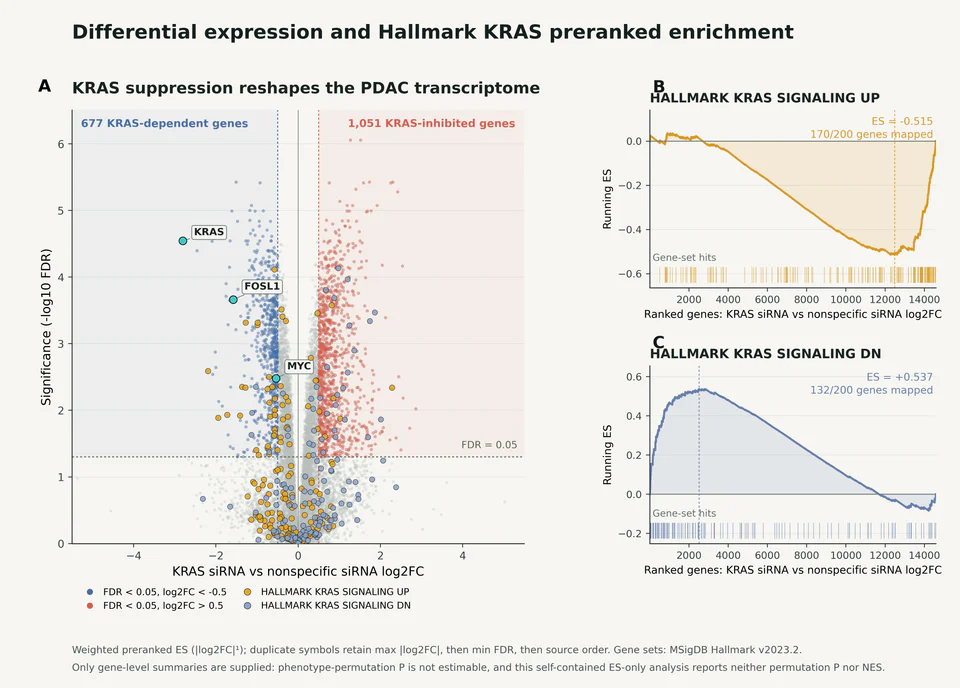
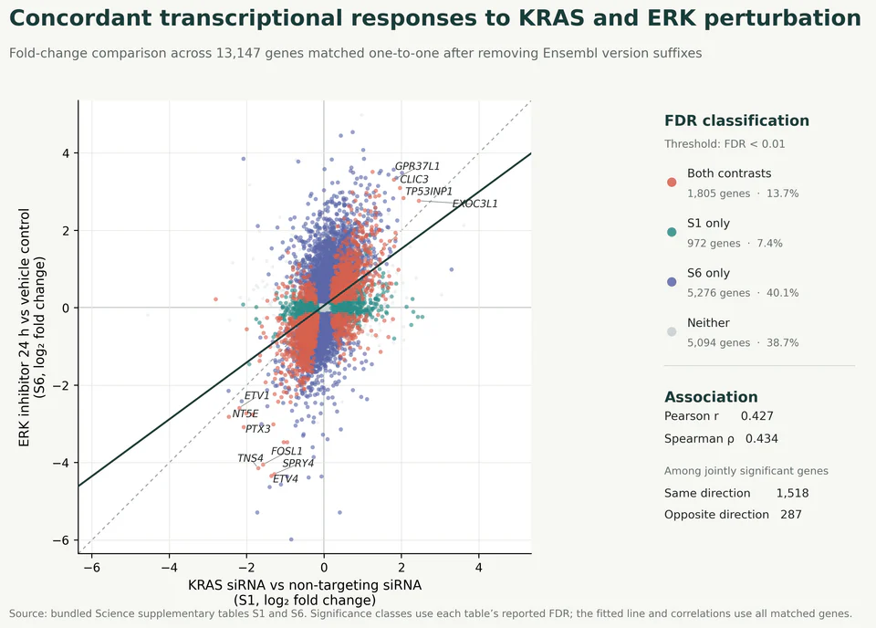
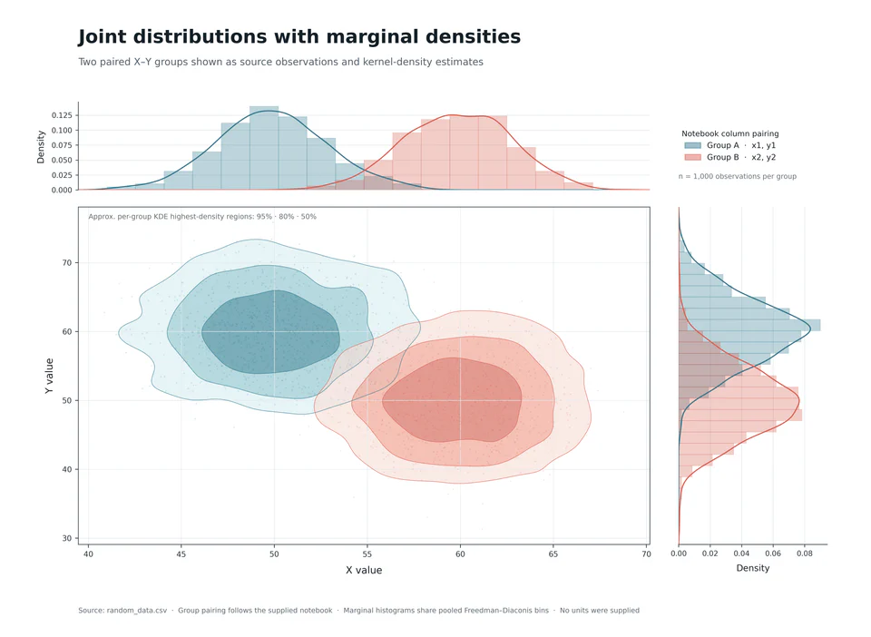
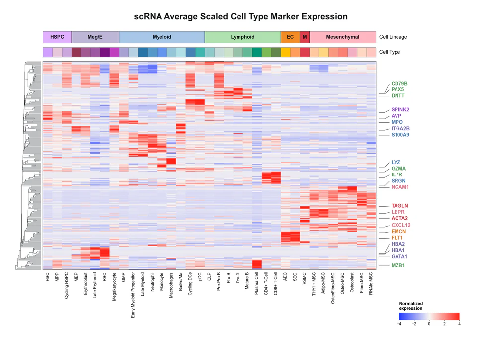
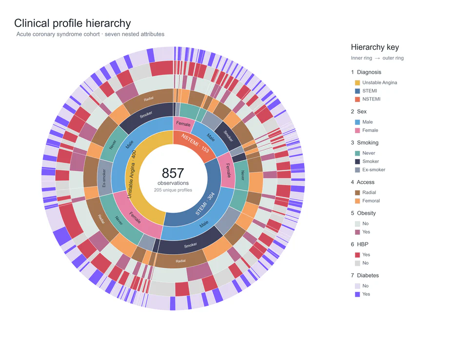
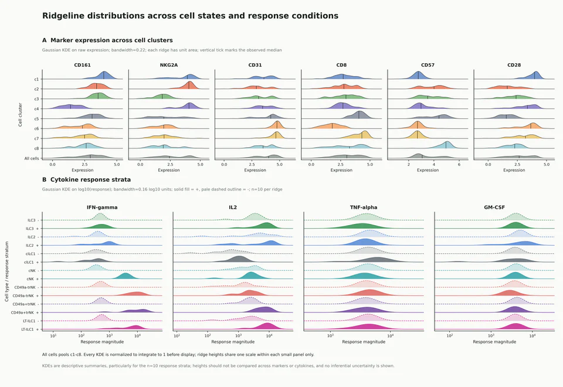
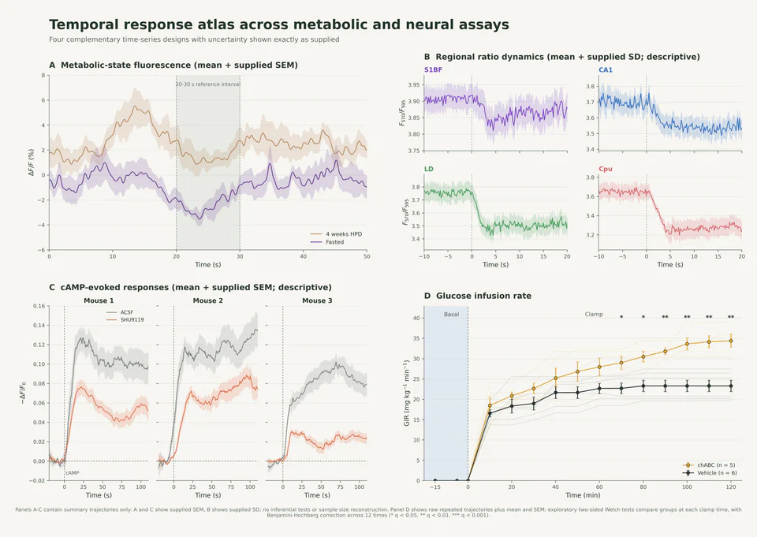
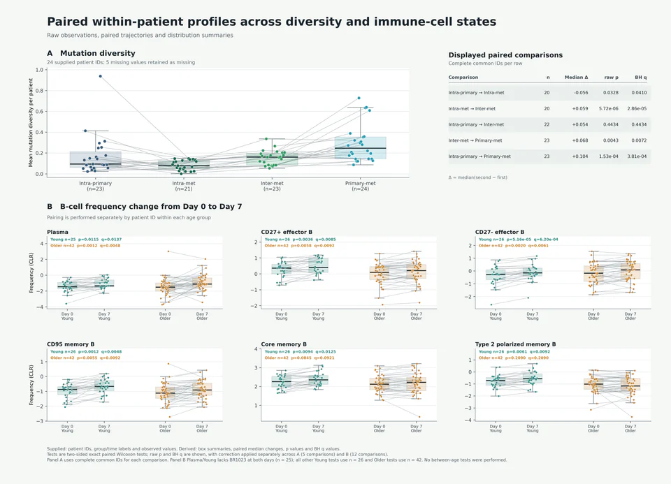

<div align="center">

# academic-figure｜科研图形优化

**提升科研图形的科学表达、视觉质量与可复现性。**

面向 Codex 的科研绘图 Skill：从研究问题、数据结构与统计口径出发，审校现有图形、推荐更合适的表达方案，并生成适合论文呈现、可复现、可审查的 Python / R 实现。所有优化均以保持科学含义、不越过证据边界为前提。

<p>
  <a href="https://github.com/SciToolsmith/academic-figure/actions/workflows/validate.yml"></a>
  <a href="LICENSE"></a>
  <a href="skills/academic-figure/SKILL.md"></a>
</p>

<p>
  <a href="https://scifigures.hihu.me/"><strong>在线检索 180 个科研图形 ↗</strong></a>
  ·
  <a href="GALLERY.md#open-templates">查看 23 个开放模板</a>
  ·
  <a href="#安装">安装 Skill</a>
</p>

</div>

<p align="center">
  <strong>从研究问题出发，找到真正适合数据的表达结构</strong><br>
  <sub>180 个可检索案例，覆盖差异、效应、不确定性与变量关系等常见科研表达。</sub>
</p>

<p align="center">
  <a href="https://scifigures.hihu.me/charts/rf-0107-volcano-preranked-gsea-enrichment-scores?lang=python"></a>
  <a href="https://scifigures.hihu.me/charts/rf-0180-kinematic-age-velocity-asymmetric-uncertainty?lang=python"></a>
  <a href="https://scifigures.hihu.me/charts/rf-0114-differential-gene-fold-change-scatter?lang=python"></a>
</p>

<p align="center">
  <a href="https://scifigures.hihu.me/charts/rf-0179-two-group-joint-density-marginal-histograms?lang=python"></a>
  <a href="https://scifigures.hihu.me/charts/rf-0042-marker-gene-heatmap?lang=python"></a>
  <a href="https://scifigures.hihu.me/charts/rf-0066-sunburst-chart?lang=python"></a>
</p>

<p align="center">
  <a href="https://scifigures.hihu.me/charts/rf-0130-faceted-ridgeline-plot?lang=python"></a>
  <a href="https://scifigures.hihu.me/charts/rf-0139-multi-panel-time-series-plots?lang=python"></a>
  <a href="https://scifigures.hihu.me/charts/rf-0173-paired-boxplots?lang=python"></a>
</p>

<p align="center">
  <a href="https://scifigures.hihu.me/"><strong>浏览完整图鉴 ↗</strong></a>
  &nbsp;&nbsp;·&nbsp;&nbsp;
  <a href="GALLERY.md#open-templates">查看 23 个开放模板</a>
</p>

## 从科学问题到可复现图形

`academic-figure` 不是固定风格套件，也不会根据参考图机械复刻版式。它根据研究问题、数据结构和统计口径完成四类工作：

- **审校**：检查现有图形或代码的科学表达、信息完整性、视觉层级和交付质量。
- **选型**：从 180 个案例的信息结构中检索候选，并判断应精确复用、结构借鉴、仅参考风格还是重新设计。
- **重构**：沿用用户的 Python 或 R 环境，生成完整、可运行、可适配的绘图脚本。
- **交付**：记录字段映射、统计口径和数据排除情况，并核对最终尺寸、矢量输出与高分辨率位图。

投稿用途默认输出“清洁画布”：图内只保留解释科学证据所需的信息；方案名称、设计说明、随机种子、模拟数据声明和运行记录放在回答或交付说明中。成图文字语言独立于 Python/R 后端判断，英文案例模板不会强制生成英文图。

核心流程：

```text
研究问题 → 数据契约 → 图形选择 → Python/R 实现 → 科学与交付 QA
```

Skill 采用渐进加载：普通审校不会读取全部案例；只有选图或寻找参考结构时才检索图鉴。

## 安装

在 Codex 中使用 `$skill-installer`：

```text
请安装这个 Skill：
https://github.com/SciToolsmith/academic-figure/tree/main/skills/academic-figure
```

手动安装：

```bash
git clone https://github.com/SciToolsmith/academic-figure.git
mkdir -p "${CODEX_HOME:-$HOME/.codex}/skills"
cp -R academic-figure/skills/academic-figure "${CODEX_HOME:-$HOME/.codex}/skills/academic-figure"
```

安装后的 Skill 根目录应直接包含 `SKILL.md`、`manifest.yaml`、`references/`、`scripts/` 和 `templates/`。

## 调用示例

```text
$academic-figure 审校这张论文图，指出科学表达和版式问题。

$academic-figure 根据我的研究问题、观察单位和数据结构推荐合适图形。

$academic-figure 用 Python 重构这张图，输出完整脚本、SVG 和 300 DPI PNG。
```

审校或选图时不要求先指定语言。需要生成代码时，Skill 会沿用用户现有的 Python/R；只有两者都合理且上下文无法判断时才询问。

## 图鉴与开放边界

| 资源 | 数量 | 开放内容 |
|---|---:|---|
| [可检索图鉴案例](GALLERY.md) | 180 | 元数据、通用提示词和缩略图 |
| 已验证开放模板 | 23 | Python/R 双实现、演示数据、README 和双版本预览 |
| 仅图鉴案例 | 157 | 不包含对应案例的完整源码 |
| 开放语言实现 | 46 | 23 Python + 23 R |

在线网站负责交互检索、高清预览与案例详情；本仓库负责 Skill、可版本化的案例索引和 23 个开放模板。

开放状态以 `releaseTier`、`openImplementation` 和 `templatePath` 为准。23 个模板的准确名单见 [开放模板注册表](skills/academic-figure/references/cases/open-template-roadmap.json)。

> `promptStatus` 只是内容编辑状态。当前 180 份提示词中有 179 份 `draft`、1 份 `pilot`；它不表示统计方法、科学结论或行为效果已经验证。

图鉴先用于检索科学任务和数据结构，再判断复用深度：`exact`、`structural`、`style-only` 或 `new`。参考案例是 3×2，并不意味着用户数据也应强制生成 3×2。

## 科学边界

- 有真实数据时使用真实数据；仅在用户没有数据且需要演示时，才使用固定种子的中性模拟数据，并在回答、代码或交付说明中明确其模拟状态，不默认把演示声明和随机种子写进投稿图。
- 中文成图需在实际渲染器中确认 CJK 字体可用，检查缺字、异常回退、混排和最终物理尺寸；不能依赖 `DejaVu Sans` 或通用 `sans` 的静默回退。
- 生存、富集、聚类和非线性模型模板优先接收上游已经计算的结果，不在绘图层手写统计推断。
- 图鉴和模板不能替代研究设计、统计审查、领域判断或人工视觉检查，也不保证期刊接收。
- 本仓库不包含其余私有案例源码或真实研究原始数据。案例素材说明见 [CASE_ASSETS.md](CASE_ASSETS.md)。

<details>
<summary><strong>查看目录与案例检索命令</strong></summary>

```text
skills/academic-figure/
├── SKILL.md                         # 入口与任务路由
├── manifest.yaml                    # 渐进加载配置
├── static/                          # 核心契约与 Python/R 后端规则
├── references/                      # 审校、选图、适配和交付 QA
├── references/cases/                # 180 案例索引、提示词和发布注册表
├── scripts/search_cases.py          # 本地案例检索
├── assets/case-atlas/               # 图鉴缩略图
├── assets/open-templates/           # 23 个开放模板的 Python/R 双版本预览
└── templates/                       # 23 个已验证 Python/R 开放实现
```

```bash
python skills/academic-figure/scripts/search_cases.py \
  "配对对象 两个时点 显示个体变化与不确定性" --limit 5

python skills/academic-figure/scripts/search_cases.py \
  "生存 风险表" --open-only --language r --limit 3
```

</details>

## 联系与反馈

如果你在科研图形复现、论文实验复现或 `academic-figure` 使用过程中需要交流，可以通过小红书联系。

**胡同学 · 小红书号**（点击代码块右上角即可复制）

```text
5015520728
```

<a href="assets/contact/xiaohongshu-card.jpg">
  
</a>

<sub>扫描二维码联系，或点击名片查看原图。</sub>

## English

`academic-figure` is a Codex Skill for improving the scientific expression, visual quality, and reproducibility of data-driven research figures. It reviews existing figures, recommends better-matched visual structures, and produces auditable Python/R implementations without changing scientific meaning. It includes a searchable 180-case atlas and 23 case-neutral open templates independently implemented and rendered in Python and R.

## Independence and license

This is an independent open-source project. It is not affiliated with or endorsed by Nature Portfolio, Springer Nature, OpenAI, or any journal or publisher. References to publication styles are descriptive only; “publication-oriented” does not imply approval or acceptance by a publisher.

Code and project-authored documentation are licensed under [Apache-2.0](LICENSE). Asset scope and provenance are described separately in [CASE_ASSETS.md](CASE_ASSETS.md).
