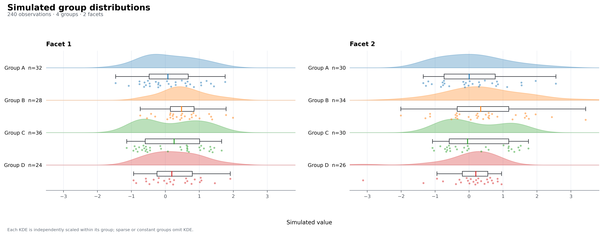
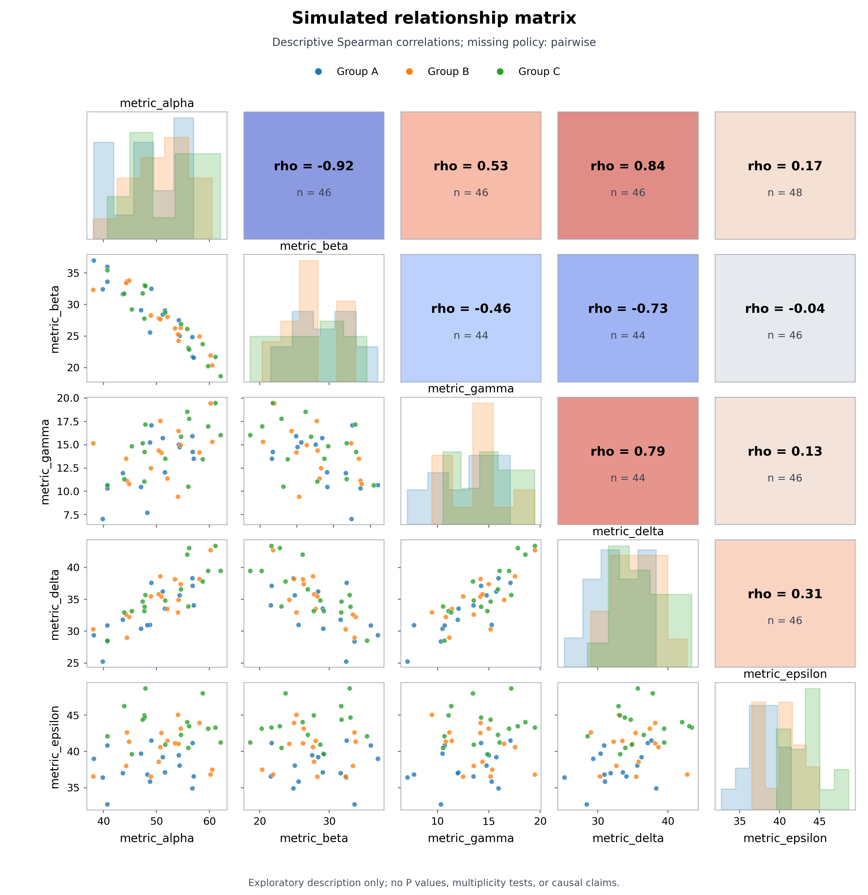
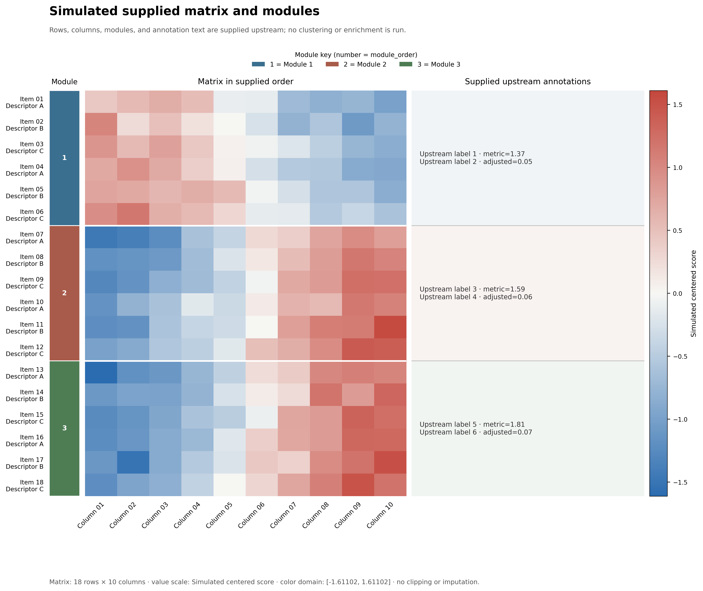

<div align="center">

# academic-figure｜学术图形顾问

**先确认科学含义，再选择图形；先建立数据契约，再编写代码。**

面向 Codex 的科研图形 Skill：审校、选型、重构并可复现地交付数据驱动的论文图形。

<p>
  <a href="https://github.com/SciToolsmith/academic-figure/actions/workflows/validate.yml"></a>
  <a href="LICENSE"></a>
  <a href="skills/academic-figure/SKILL.md"></a>
</p>

</div>

`academic-figure` 在不改变科学含义和证据边界的前提下，帮助用户完成四类任务：

- **审校**：检查现有图形或代码的科学表达、数据完整性、视觉层级和交付质量。
- **选图**：根据研究问题、数据结构和变量关系推荐合适的信息结构。
- **重构**：用 Python 或 R 生成完整、可运行、可适配的绘图脚本。
- **交付**：核对字段映射、统计口径、排除记录、最终尺寸及矢量/高分辨率输出。

它是一个渐进加载的轻量路由器，不会在每次调用时读取全部案例和提示词。

## 安装

在 Codex 中使用 `$skill-installer`：

```text
请安装这个 Skill：
https://github.com/SciToolsmith/academic-figure/tree/main/skills/academic-figure
```

手动安装：

```bash
git clone https://github.com/SciToolsmith/academic-figure.git
mkdir -p "${CODEX_HOME:-$HOME/.codex}/skills"
cp -R academic-figure/skills/academic-figure "${CODEX_HOME:-$HOME/.codex}/skills/academic-figure"
```

安装后的 Skill 根目录应直接包含 `SKILL.md`、`manifest.yaml`、`references/`、`scripts/` 和 `templates/`。

## 调用示例

```text
$academic-figure 审校这张论文图，指出科学表达和版式问题。

$academic-figure 根据我的研究问题、观察单位和数据结构推荐合适图形。

$academic-figure 用 Python 重构这张图，输出完整脚本、SVG 和 300 DPI PNG。
```

审校或选图时不要求先指定语言。需要生成代码时，Skill 会沿用用户现有的 Python/R；只有两者都合理且上下文无法判断时才询问。

## 180-case atlas + 23 validated open templates

| 资源 | 数量 | 开放边界 |
|---|---:|---|
| 可检索图鉴案例 | 180 | 元数据、通用提示词和缩略图 |
| 已验证开放模板 | 23 | Python/R 双实现、演示数据、README 和双语预览 |
| 仅图鉴案例 | 157 | 不包含对应案例的完整源码 |
| 开放语言实现 | 46 | 23 Python + 23 R |

开放状态以 `releaseTier`、`openImplementation` 和 `templatePath` 为准。23 个模板的准确名单见 [开放模板注册表](skills/academic-figure/references/cases/open-template-roadmap.json)。

> `promptStatus` 只是内容编辑状态。当前 180 份提示词中有 179 份 `draft`、1 份 `pilot`；它不表示统计方法、科学结论或行为效果已经验证。

<table role="presentation">
  <tr>
    <td width="33%"></td>
    <td width="33%"></td>
    <td width="33%"></td>
  </tr>
  <tr>
    <td><code>rf-0104</code> 分布与原始观测</td>
    <td><code>rf-0049</code> 描述性关系矩阵</td>
    <td><code>rf-0054</code> 已排序矩阵与上游注释</td>
  </tr>
</table>

图鉴先用于检索科学任务和数据结构，再判断复用深度：`exact`、`structural`、`style-only` 或 `new`。参考案例是 3×2，并不意味着用户数据也应强制生成 3×2。

## 科学与公开边界

- 有真实数据时使用真实数据；仅在用户没有数据且需要演示时，才使用明确标注、固定种子的中性模拟数据。
- 生存、富集、聚类和非线性模型模板优先接收上游已经计算的结果，不在绘图层手写统计推断。
- 图鉴和模板不能替代研究设计、统计审查、领域判断或人工视觉检查，也不保证期刊接收。
- 本仓库不包含其余私有案例源码或真实研究原始数据。案例素材说明见 [CASE_ASSETS.md](CASE_ASSETS.md)。

## 目录

```text
skills/academic-figure/
├── SKILL.md                         # 入口与任务路由
├── manifest.yaml                    # 渐进加载配置
├── static/                          # 核心契约与 Python/R 后端规则
├── references/                      # 审校、选图、适配和交付 QA
├── references/cases/                # 180 案例索引、提示词和发布注册表
├── scripts/search_cases.py          # 本地案例检索
├── assets/case-atlas/               # 图鉴缩略图
├── assets/open-templates/           # 23 个开放模板的双语预览
└── templates/                       # 23 个已验证 Python/R 开放实现
```

案例检索示例：

```bash
python skills/academic-figure/scripts/search_cases.py \
  "配对对象 两个时点 显示个体变化与不确定性" --limit 5

python skills/academic-figure/scripts/search_cases.py \
  "生存 风险表" --open-only --language r --limit 3
```

## English

`academic-figure` is a Codex Skill for reviewing, selecting, redesigning, and reproducibly rebuilding data-driven scientific figures without changing their scientific meaning. It includes a searchable 180-case atlas and 23 case-neutral open templates independently implemented and rendered in Python and R.

## Independence and license

This is an independent open-source project. It is not affiliated with or endorsed by Nature Portfolio, Springer Nature, OpenAI, or any journal or publisher. References to publication styles are descriptive only; “publication-oriented” does not imply approval or acceptance by a publisher.

Code and project-authored documentation are licensed under [Apache-2.0](LICENSE). Asset scope and provenance are described separately in [CASE_ASSETS.md](CASE_ASSETS.md).
