<div align="center">

# SciPlot｜科研绘图

**先设计科学论证，再选择图形。**<br>
*Design the evidence before the chart.*

一个面向 Codex 的科研绘图 Agent Skill：从科学问题、数据结构与统计语义出发，创建、修改和审查可复现的论文级图件。

<p>
  <a href="https://github.com/SciToolsmith/sci-plot/actions/workflows/validate.yml"></a>
  <a href="LICENSE"></a>
  <a href="skills/sci-plot/SKILL.md"></a>
  <a href="skills/sci-plot/references/case-index.md"></a>
</p>

<a href="#install"><strong>30 秒安装</strong></a>
·
<a href="#gallery"><strong>18 案例图谱</strong></a>
·
<a href="#workflow"><strong>工作方式</strong></a>
·
<a href="#examples"><strong>调用示例</strong></a>
·
<a href="#english"><strong>English</strong></a>

</div>

> [!IMPORTANT]
> **案例不是模板，也不是能力边界。** SciPlot 会先完成 Figure Contract 与证据架构，再把案例当作可选设计先验；没有语义匹配时，明确选择 `build-new`，继续原创设计。

| **18** 个设计案例 | **36** 份参考源码 | **1** 个原生 renderer | **7** 张风险卡 | **5** 条任务路线 |
|:---:|:---:|:---:|:---:|:---:|
| 科学表达决策 | Python + R 作者复现 | 独立契约与测试 | 常见失败模式 | Create · Adapt · Revise · Review · Export |

## 为什么是 SciPlot

科研图不是装饰过的数据容器，而是一条可以被检查的视觉论证：

`问题或主张 → 证据 → 面板角色 → 视觉编码 → 渲染图件`

| 常见起点 | SciPlot 的起点 |
|---|---|
| “这组数据适合画什么图？” | “读者需要用什么证据判断这个主张？” |
| 先找一张外观相近的图 | 先明确分析单位、重复单位、数据结构和推断边界 |
| 复用版式时顺带迁移统计逻辑 | 案例只在语义兼容时复用，并显式选择复用等级 |
| 图导出成功就算完成 | 分别验证代码、运行、文件、视觉质量和科学有效性 |
| 缺少案例就停止或强行匹配 | 返回 `no-suitable-case`，转入原则驱动的原创设计 |

SciPlot 支持五条任务路线：

- **Create**：从数据、结果或研究问题创建新图件。
- **Adapt**：只在科学语义兼容后适配参考设计或实现。
- **Revise**：在不静默改变科学含义的前提下修改现有图或代码。
- **Review**：只读审查统计语义、数据完整性、视觉表达、复现性和导出质量。
- **Export**：锁定科学和视觉含义，只做转换与产物验证。

<a id="install"></a>

## 30 秒安装

在 Codex 中粘贴：

```text
请使用 $skill-installer 安装：
https://github.com/SciToolsmith/sci-plot/tree/main/skills/sci-plot
```

安装后用 `$sci-plot` 显式调用。Codex 通常会自动检测新 skill；如果没有出现，请重启 Codex。

<details>
<summary><strong>手动安装 / Manual installation</strong></summary>

```bash
git clone https://github.com/SciToolsmith/sci-plot.git
mkdir -p "${CODEX_HOME:-$HOME/.codex}/skills"
cp -R sci-plot/skills/sci-plot "${CODEX_HOME:-$HOME/.codex}/skills/sci-plot"
```

也可以复制到项目的 `.agents/skills/sci-plot/`，使它只在当前仓库范围内生效。参见 OpenAI 的 [Build skills](https://developers.openai.com/plugins/build/skills)。

</details>

<a id="gallery"></a>

## 18 个科学表达决策

这不是“18 种图表类型”，而是 18 种需要做对的科学表达决策。点击图片可查看原尺寸。

- **Audit status**：`admitted` 可作为正向参考；`conditional` 必须先满足
  `repair_gate`。
- **Implementation status**：`verified`、`language-specific`、
  `static-reviewed` 只说明逻辑案例在原项目审计时的实现验证深度，不替代
  科学审计，也不表示随 skill 打包的 Python/R 两个入口及缺失输入都已生产验证。
- **Reuse level**：`exact`、`structural`、`style-only`、`build-new`
  由当前任务决定，不写入案例状态。

### 01｜观测与效应估计 · Observation & estimation

<table role="presentation">
  <tr>
    <td width="33%" valign="top">
      <a href="skills/sci-plot/assets/cases/rf-0104.webp">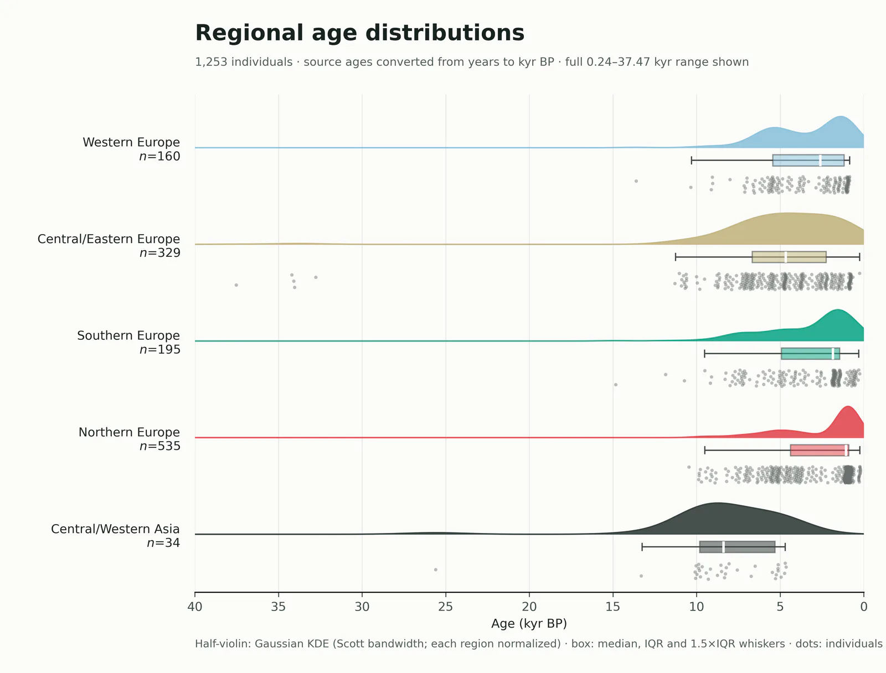</a><br>
      <strong><code>rf-0104</code> 让分布与原始观测同场</strong><br>
      Core · Distribution + raw observations<br>
      <strong>Audit: CONDITIONAL · Impl: STATIC-REVIEWED</strong>
    </td>
    <td width="33%" valign="top">
      <a href="skills/sci-plot/assets/cases/rf-0173.webp"></a><br>
      <strong><code>rf-0173</code> 保留每个对象的配对变化</strong><br>
      Core · Paired change + missingness<br>
      <strong>Audit: CONDITIONAL · Impl: STATIC-REVIEWED</strong>
    </td>
    <td width="33%" valign="top">
      <a href="skills/sci-plot/assets/cases/rf-0088.webp">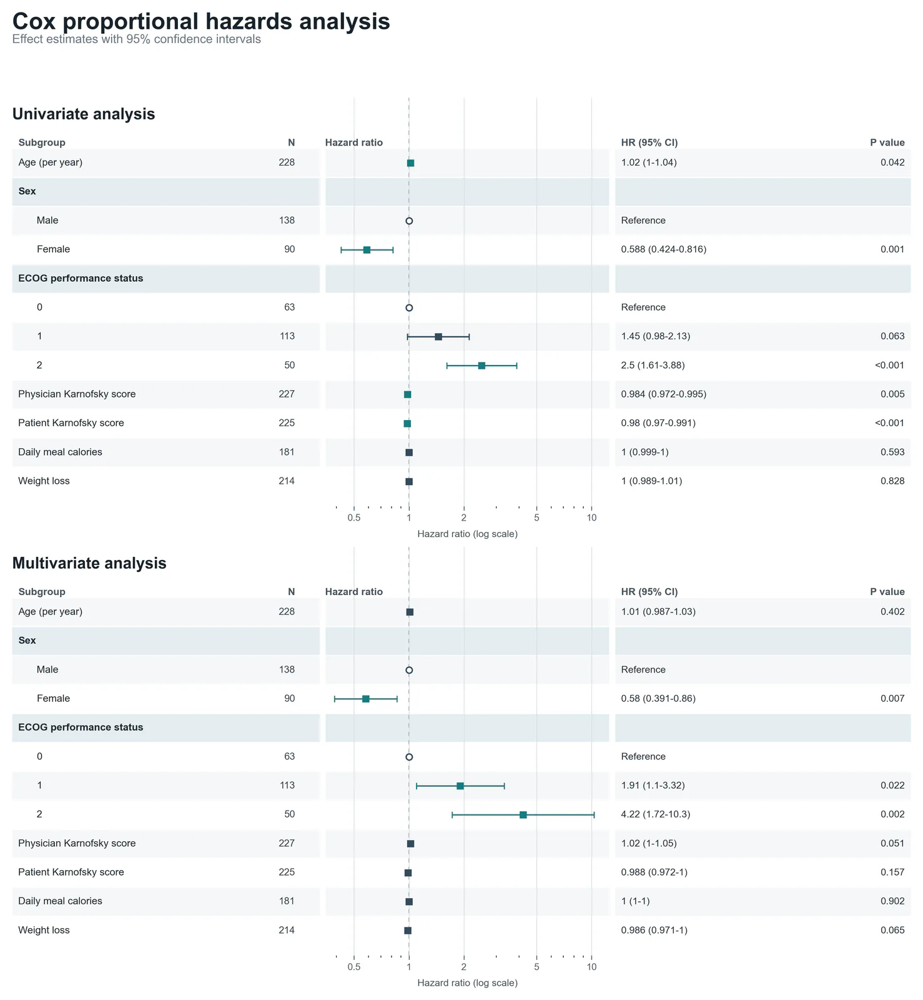</a><br>
      <strong><code>rf-0088</code> 对齐效应量、区间与变量</strong><br>
      Core · Effect estimates + covariate table<br>
      <strong>Audit: CONDITIONAL · Impl: STATIC-REVIEWED</strong>
    </td>
  </tr>
</table>

### 02｜关系、模型与结构 · Relationship, model & structure

<table role="presentation">
  <tr>
    <td width="33%" valign="top">
      <a href="skills/sci-plot/assets/cases/rf-0178.webp">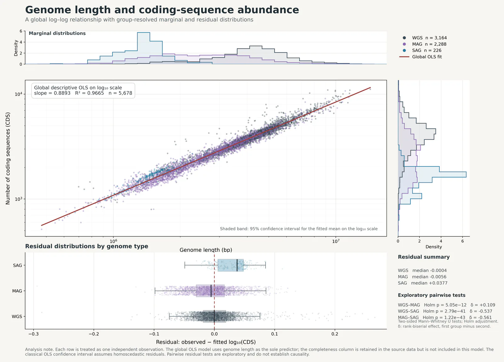</a><br>
      <strong><code>rf-0178</code> 让拟合与残差共同作证</strong><br>
      Core · Fit + marginals + diagnostics<br>
      <strong>Audit: ADMITTED · Impl: VERIFIED</strong>
    </td>
    <td width="33%" valign="top">
      <a href="skills/sci-plot/assets/cases/rf-0180.webp">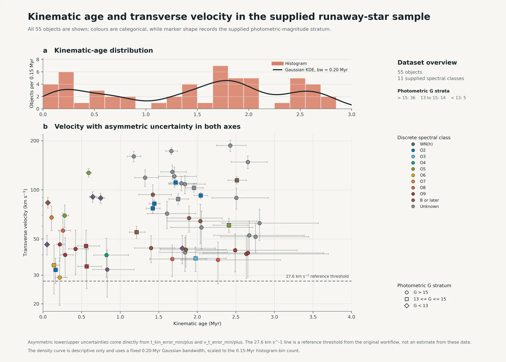</a><br>
      <strong><code>rf-0180</code> 保留双轴非对称不确定性</strong><br>
      Core · Bivariate measurement uncertainty<br>
      <strong>Audit: CONDITIONAL · Impl: STATIC-REVIEWED</strong>
    </td>
    <td width="33%" valign="top">
      <a href="skills/sci-plot/assets/cases/rf-0102.webp">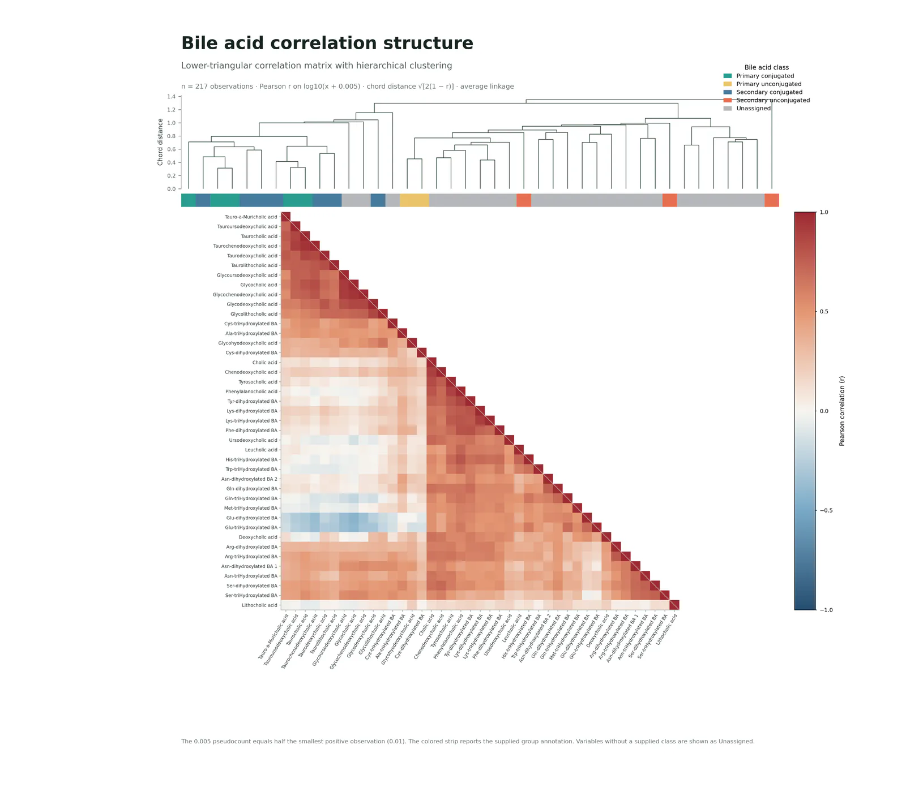</a><br>
      <strong><code>rf-0102</code> 绑定相关结构与聚类决策</strong><br>
      Core · Correlation + hierarchical clustering<br>
      <strong>Audit: CONDITIONAL · Impl: STATIC-REVIEWED</strong>
    </td>
  </tr>
</table>

### 03｜时间与过程 · Time & process

<table role="presentation">
  <tr>
    <td width="33%" valign="top">
      <a href="skills/sci-plot/assets/cases/rf-0018.webp">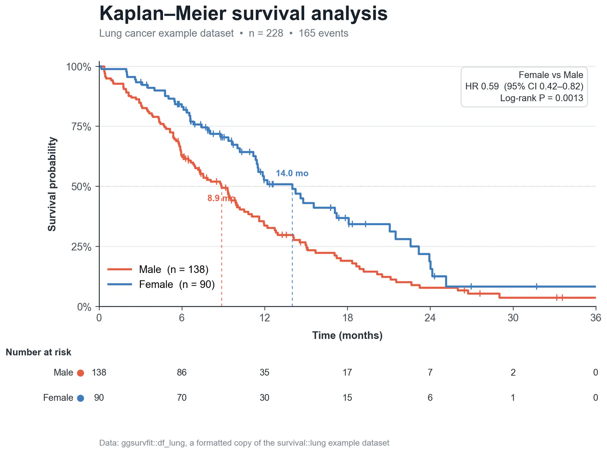</a><br>
      <strong><code>rf-0018</code> 联读生存、删失与在险人数</strong><br>
      Core · Survival + censoring + risk table<br>
      <strong>Audit: ADMITTED · Impl: VERIFIED</strong>
    </td>
    <td width="33%" valign="top">
      <a href="skills/sci-plot/assets/cases/rf-0061.webp">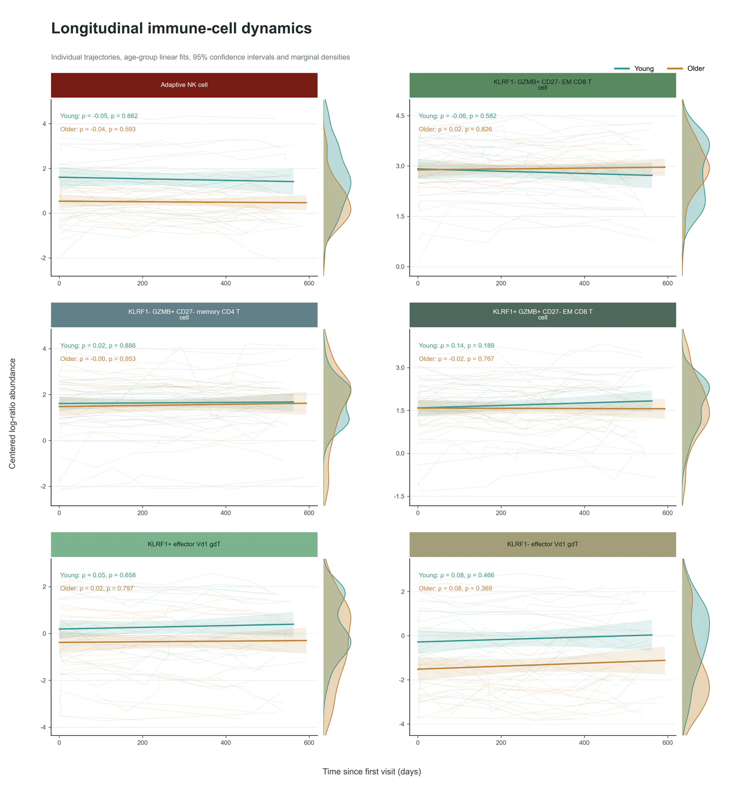</a><br>
      <strong><code>rf-0061</code> 兼顾个体轨迹与组级趋势</strong><br>
      Core · Longitudinal individual + group dynamics<br>
      <strong>Audit: ADMITTED · Impl: LANGUAGE-SPECIFIC</strong>
    </td>
    <td width="33%" valign="top">
      <a href="skills/sci-plot/assets/cases/rf-0035.webp">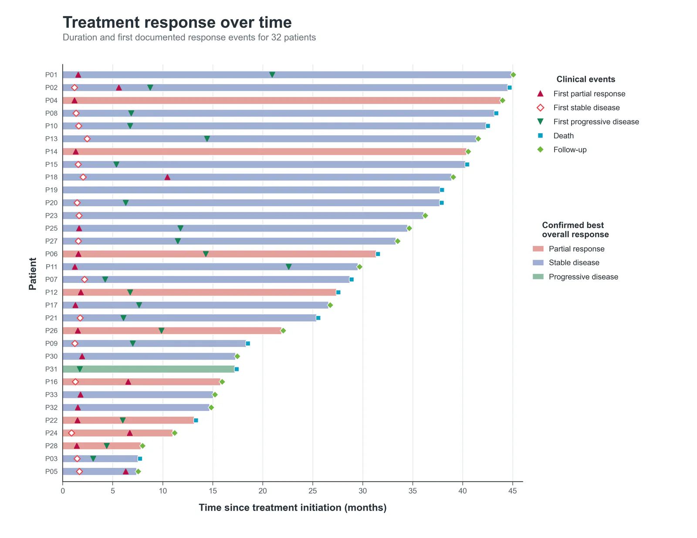</a><br>
      <strong><code>rf-0035</code> 沿时间轴呈现对象历程</strong><br>
      Extension · Timelines + discrete events<br>
      <strong>Audit: CONDITIONAL · Impl: STATIC-REVIEWED</strong>
    </td>
  </tr>
</table>

### 04｜组成、集合与流向 · Composition, sets & flow

<table role="presentation">
  <tr>
    <td width="33%" valign="top">
      <a href="skills/sci-plot/assets/cases/rf-0001.webp">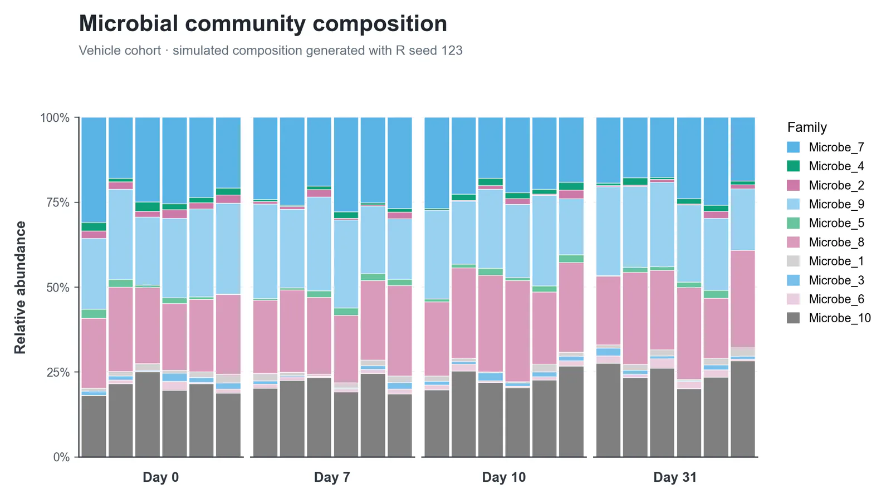</a><br>
      <strong><code>rf-0001</code> 在共同分母下比较组成</strong><br>
      Core · Composition under a common denominator<br>
      <strong>Audit: ADMITTED · Impl: VERIFIED</strong>
    </td>
    <td width="33%" valign="top">
      <a href="skills/sci-plot/assets/cases/rf-0157.webp">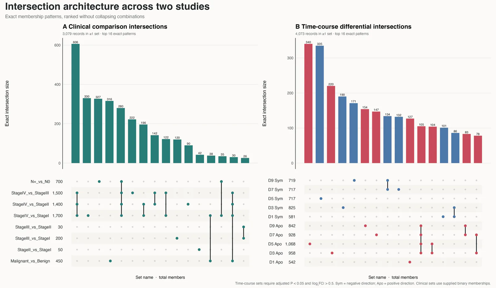</a><br>
      <strong><code>rf-0157</code> 区分精确交集与集合规模</strong><br>
      Core · Exact intersections + set sizes<br>
      <strong>Audit: CONDITIONAL · Impl: VERIFIED</strong>
    </td>
    <td width="33%" valign="top">
      <a href="skills/sci-plot/assets/cases/rf-0118.webp">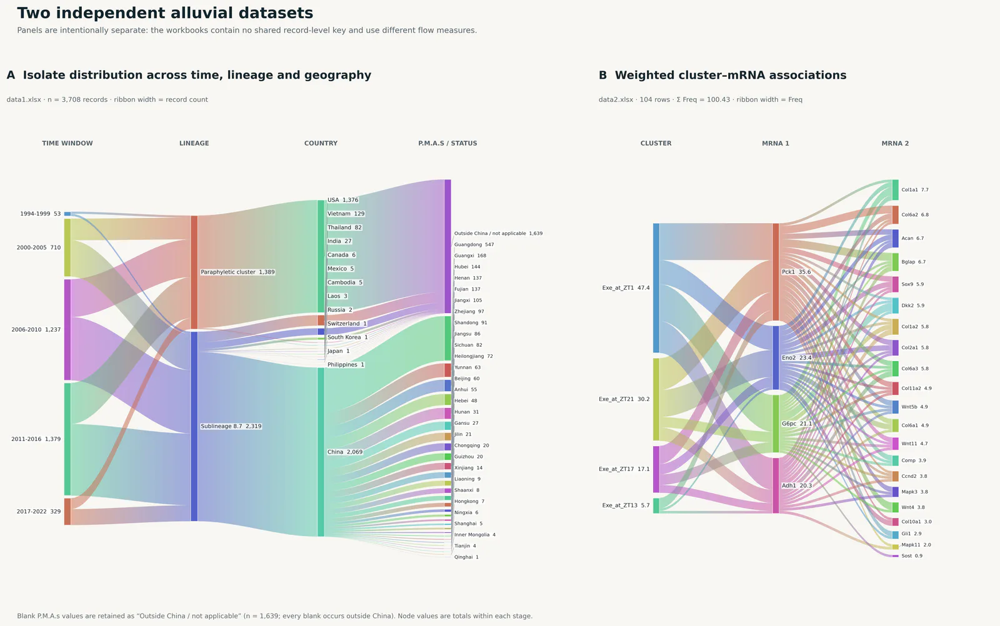</a><br>
      <strong><code>rf-0118</code> 明确多阶段流带的带宽语义</strong><br>
      Extension · Multi-stage flow + width semantics<br>
      <strong>Audit: CONDITIONAL · Impl: STATIC-REVIEWED</strong>
    </td>
  </tr>
</table>

### 05｜多组学与高维结构 · Multi-omics & high-dimensional structure

<table role="presentation">
  <tr>
    <td width="33%" valign="top">
      <a href="skills/sci-plot/assets/cases/rf-0107.webp">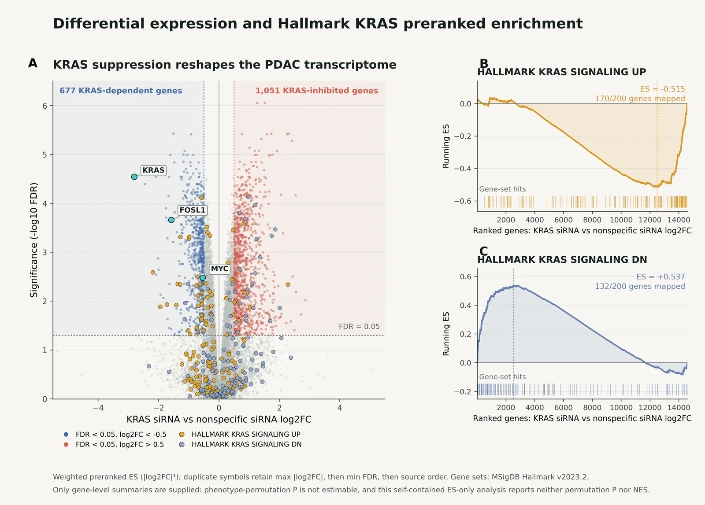</a><br>
      <strong><code>rf-0107</code> 连接特征差异与通路富集</strong><br>
      Core · Feature differences → pathway enrichment<br>
      <strong>Audit: CONDITIONAL · Impl: STATIC-REVIEWED</strong>
    </td>
    <td width="33%" valign="top">
      <a href="skills/sci-plot/assets/cases/rf-0054.webp">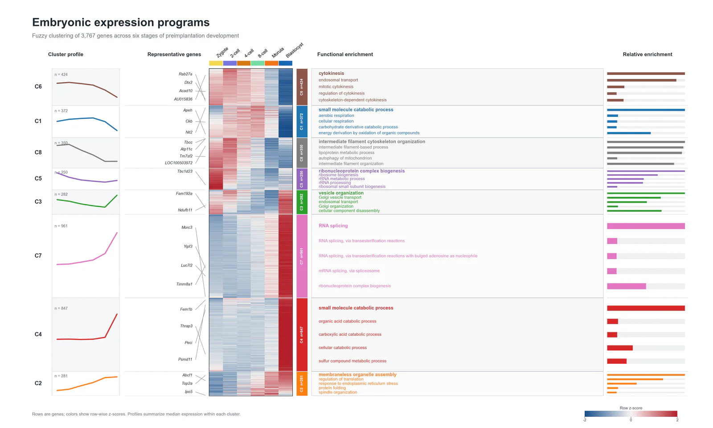</a><br>
      <strong><code>rf-0054</code> 对齐模块模式与功能注释</strong><br>
      Extension · Cluster pattern + functional annotation<br>
      <strong>Audit: CONDITIONAL · Impl: STATIC-REVIEWED</strong>
    </td>
    <td width="33%" valign="top">
      <a href="skills/sci-plot/assets/cases/rf-0176.webp">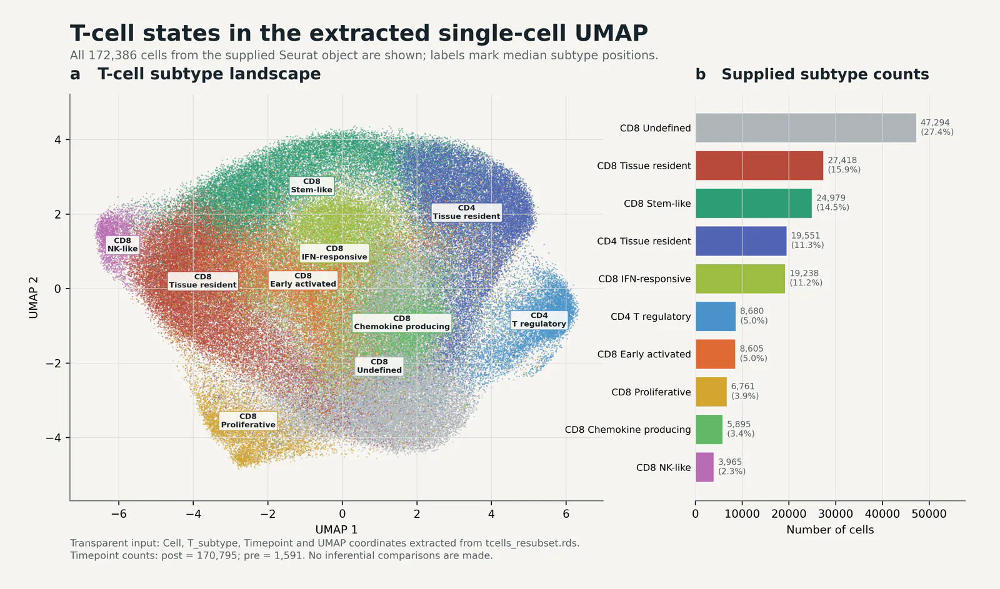</a><br>
      <strong><code>rf-0176</code> 只展示已计算的低维坐标</strong><br>
      Extension · Precomputed embedding<br>
      <strong>Audit: CONDITIONAL · Impl: STATIC-REVIEWED</strong>
    </td>
  </tr>
</table>

### 06｜多源证据整合 · Multi-source evidence integration

<table role="presentation">
  <tr>
    <td width="33%" valign="top">
      <a href="skills/sci-plot/assets/cases/rf-0109.webp">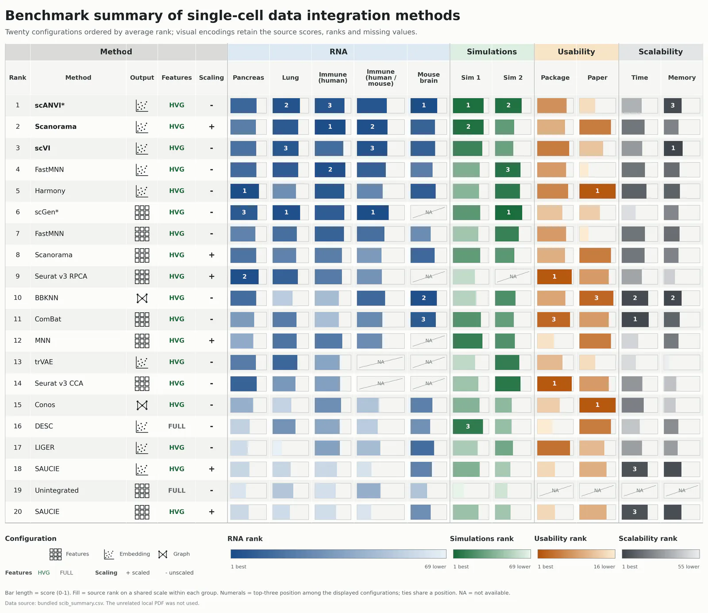</a><br>
      <strong><code>rf-0109</code> 让排名、分数与缺失对齐</strong><br>
      Core · Ranking + scores + missingness + settings<br>
      <strong>Audit: ADMITTED · Impl: VERIFIED</strong>
    </td>
    <td width="33%" valign="top">
      <a href="skills/sci-plot/assets/cases/rf-0063.webp">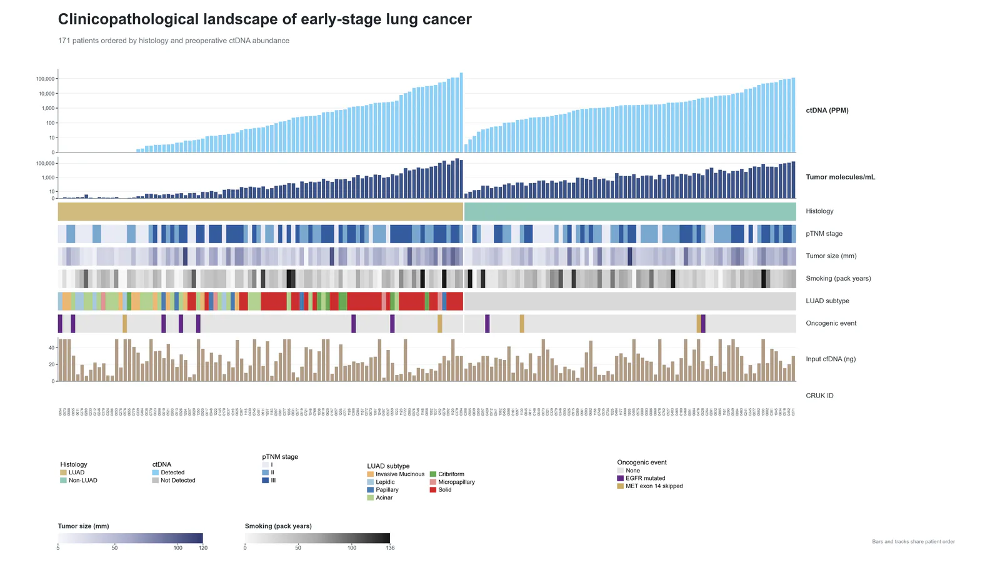</a><br>
      <strong><code>rf-0063</code> 让临床轨道共享患者顺序</strong><br>
      Extension · Patient-aligned heterogeneous tracks<br>
      <strong>Audit: CONDITIONAL · Impl: STATIC-REVIEWED</strong>
    </td>
    <td width="33%" valign="top">
      <a href="skills/sci-plot/assets/cases/rf-0159.webp">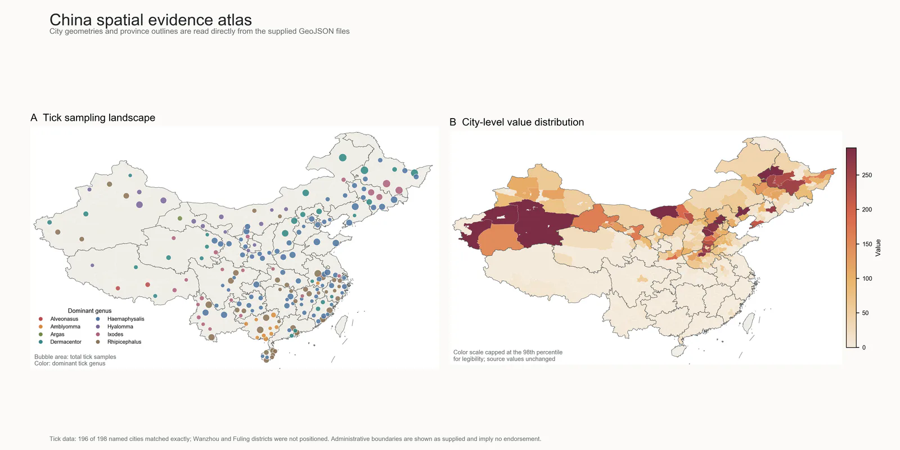</a><br>
      <strong><code>rf-0159</code> 以空间契约约束地图表达</strong><br>
      Extension · CRS + boundary version + spatial values<br>
      <strong>Audit: CONDITIONAL · Impl: STATIC-REVIEWED</strong>
    </td>
  </tr>
</table>

完整的机器索引见 [`case-index.json`](skills/sci-plot/references/case-index.json)，设计卡见 [`cases-core.md`](skills/sci-plot/references/cases-core.md) 与 [`cases-extensions.md`](skills/sci-plot/references/cases-extensions.md)。案例素材的原创复现与公开边界见 [`CASE_ASSETS.md`](CASE_ASSETS.md)。

### 案例复用只允许四种等级

| 等级 | 何时使用 | 必须重做什么 |
|---|---|---|
| **Exact reuse** | 科学语义、维度、变换和输入契约均兼容 | 当前数据的数值、统计、图注与 QA |
| **Structural adaptation** | 证据逻辑相同，但字段或单位不同 | 字段、单位、顺序、重复单位与统计映射 |
| **Style-only inheritance** | 只需要视觉语言或注释语法 | 全部数据与统计逻辑 |
| **Build new** | 问题、结构或推断假设不同，或没有合适案例 | 从 Figure Contract 与图形语法重新设计 |

### 案例现在不只是一张静态图

SciPlot 把“参考”和“可执行”拆成三层，避免把能画出来误当成科学上可复用：

| 层 | 当前内容 | 可以做什么 | 不能自动说明什么 |
|---|---|---|---|
| **Semantic case** | 18 个案例卡与预览 | 学习一种科学表达决策，做语义检索 | 不代表代码或数据可直接复用 |
| **Reference source pack** | 每例 Python + R，共 36 份作者复现源码 | 检查布局、实现和适配成本 | 不含论文原始数据，也不是生产模板 |
| **Verified implementation** | `composition-bars-v1` | 在输入契约和守卫通过后生成 SVG/PDF/PNG 与审计文件 | 不会覆盖 Figure Contract 或替代科学判断 |

生产任务在通过语义门槛后，优先选择兼容的原生 verified implementation。
只有没有原生实现、需要实现取证，或用户明确要求忠实复现时，才暂存参考源码包。

源码适配必须先查看清单，再把一个后端复制到新的暂存目录；不会在 skill
目录原地执行：

```bash
python skills/sci-plot/scripts/stage_case.py --describe rf-0001 --json
python skills/sci-plot/scripts/stage_case.py rf-0001 \
  --backend python \
  --reuse-level structural \
  --workdir /path/to/new-task-directory
```

原生 implementation 与案例源码独立维护：

```bash
python skills/sci-plot/scripts/validate_implementations.py --pretty
```

第一版 `composition-bars-v1` 会拒绝重复键、缺失类别、NaN/Inf、负值、
未闭合比例、模拟数据冒充生产输入和非空输出目录。它不静默归一化比例，
只有显式 `counts` 模式才换算份额并逐样本记录分母；输出同时包含
`analysis-table.csv`、`data-validation.json` 和 Render Manifest。
生产运行必须传入 Figure Contract，并机械核对任务阶段、有效行数、正式
格式集合、物理尺寸和 DPI；渲染后还会复核合同哈希、Manifest 与实际文件。
CLI 中的 183 × 105 mm 与 300 dpi 只是实现默认提案；生产值必须在看到真实
facet、sample 和 category 数量后写入 Figure Contract，不能把默认值当期刊规范。

<a id="workflow"></a>

## 工作方式

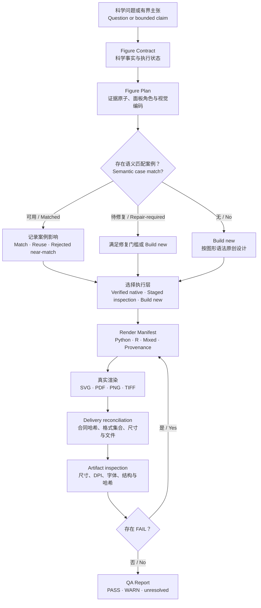
```mermaid
flowchart TD
    A["科学问题或有界主张<br/>Question or bounded claim"] --> B["Figure Contract<br/>科学事实与执行状态"]
    B --> C["Figure Plan<br/>证据原子、面板角色与视觉编码"]
    C --> D{"存在语义匹配案例？<br/>Semantic case match?"}
    D -->|"可用 / Matched"| E["记录案例影响<br/>Match · Reuse · Rejected near-match"]
    D -->|"待修复 / Repair-required"| F1["满足修复门槛或 Build new"]
    D -->|"无 / No"| F2["Build new<br/>按图形语法原创设计"]
    E --> L["选择执行层<br/>Verified native · Staged inspection · Build new"]
    F1 --> L
    F2 --> L
    L --> G["Render Manifest<br/>Python · R · Mixed · Provenance"]
    G --> H["真实渲染<br/>SVG · PDF · PNG · TIFF"]
    H --> H2["Delivery reconciliation<br/>合同哈希、格式集合、尺寸与文件"]
    H2 --> I["Artifact inspection<br/>尺寸、DPI、字体、结构与哈希"]
    I --> J{"存在 FAIL？"}
    J -->|"是 / Yes"| G
    J -->|"否 / No"| K["QA Report<br/>PASS · WARN · unresolved"]
```

Figure Contract 会在选版式前固定最容易被图形悄悄改变的内容：科学问题、分析单位、重复单位、样本量定义、单位、中心与不确定性、检验或模型、过滤与变换，以及最终尺寸和格式。任务同时标记为 `proceed`、`prototype-only` 或 `blocked`；存在影响科学真实性的阻塞项时，不进入生产渲染。

<a id="examples"></a>

## 调用示例

| 目标 | 可以直接交给 Codex 的提示 |
|---|---|
| **创建主图** | `$sci-plot 根据这份数据和研究问题设计一张论文主图，输出可编辑 SVG、预览图、Figure Contract 和 QA 结果。` |
| **适配参考图** | `$sci-plot 先检查这张参考图与我的数据是否科学兼容；只迁移通过语义门槛的设计决策。` |
| **重构多面板图** | `$sci-plot 在不改变统计含义的前提下重构这个多面板图，并记录前后差异。` |
| **只读审查** | `$sci-plot 审查这张图的数据完整性、统计语义、视觉诚实性、可读性和导出质量；先不要修改文件。` |
| **只做导出检查** | `$sci-plot 不改图形内容，只检查 PDF/SVG 的尺寸、字体、裁切和文件完整性。` |
| **无案例原创设计** | `$sci-plot 不要求匹配现有案例；请从科学问题和数据结构出发原创设计，并说明每个面板的证据角色。` |

## 交付不是一张“看起来完成”的图

Create、Adapt 或 Revise 路线默认要求：

- 可运行的 Python、R 或明确记录的混合工作流；
- 可编辑的主图件（适合时优先 SVG/PDF）与审阅预览；
- 完整或更新后的 Figure Contract；
- 过滤、变换、聚合、统计、案例影响和后端来源记录；
- 在目标物理尺寸下完成的 QA 结果与未解决限制。

Review 路线保持只读，按科学含义、数据完整性、统计语义、视觉沟通、可复现性和导出质量分组报告问题，并为每个可操作问题给出严重程度、证据和范围明确的修复建议。

Export 路线锁定现有科学与视觉含义，只执行转换和文件级验证；不会把文件检查冒充科学验证。

## 风险卡与完成度

[`risk-cards.md`](skills/sci-plot/references/risk-cards.md) 目前覆盖 7 类常见失败模式，包括不完整的误差棒与星号语义、数值范围与标签冲突、按结果排序制造趋势、模拟嵌入替代真实坐标、案例阈值冒充通用统计规则、“脚本运行成功但图仍然错误”，以及组成图隐藏绝对总量与缺失类别。

SciPlot 明确区分：

1. Figure Contract 是否完整且诚实；
2. 数据完整性账本是否闭合；
3. 统计语义是否准确；
4. 脚本能否在声明的后端实际运行；
5. Figure Contract、Render Manifest 与正式交付物是否一致；
6. 导出文件的格式、尺寸、字体和结构是否有效；
7. 图件在目标尺寸下是否清晰且无误导；
8. 主张与可见证据是否一一对应；
9. 数据、代码、案例影响和后端来源是否可追踪。

任何一层都不能替代其他层。

## 仓库结构

```text
skills/sci-plot/
├── SKILL.md
├── agents/openai.yaml
├── assets/
│   ├── cases/                 # 18 张预览
│   └── case-packs/            # 18 × Python/R 参考源码
├── implementations/           # SciPlot 原生、独立验证的 renderer
├── evals/evals.json
├── references/
├── scripts/
└── tests/
```

- [`SKILL.md`](skills/sci-plot/SKILL.md)：主工作流、触发范围和交付要求。
- [`references/`](skills/sci-plot/references/)：Figure Contract、图形语法、数据完整性、案例卡、风险卡与 QA。
- [`rank_cases.py`](skills/sci-plot/scripts/rank_cases.py)：按科学语义检索候选案例，允许无匹配结果。
- [`stage_case.py`](skills/sci-plot/scripts/stage_case.py)：检查或暂存一个参考源码后端，不在 skill 内原地执行。
- [`validate_implementations.py`](skills/sci-plot/scripts/validate_implementations.py)：校验原生 implementation 的清单、源码哈希、fixture 与验证证据。
- [`validate_contract.py`](skills/sci-plot/scripts/validate_contract.py)：执行 plan、pre-render、final 三阶段 Figure Contract 门槛。
- [`validate_delivery.py`](skills/sci-plot/scripts/validate_delivery.py)：核对合同哈希、正式格式、尺寸、DPI、Manifest 文件路径与产物哈希。
- [`semantic_diff.py`](skills/sci-plot/scripts/semantic_diff.py)：检测修改前后的未授权科学语义变化。
- [`inspect_artifacts.py`](skills/sci-plot/scripts/inspect_artifacts.py)：实测 SVG/PDF/PNG/TIFF 的结构、尺寸、DPI、字体风险和哈希。
- [`build_qa_report.py`](skills/sci-plot/scripts/build_qa_report.py)：合并契约与产物证据，生成统一 QA 报告。
- [`schema-vocabularies.json`](skills/sci-plot/references/schema-vocabularies.json)：集中定义稳定的机器枚举。
- [`retrieval-lexicon.json`](skills/sci-plot/references/retrieval-lexicon.json)：独立维护中英文检索别名与变换守卫词，不污染机器 schema。
- [`check_vocab_drift.py`](skills/sci-plot/scripts/check_vocab_drift.py)：核对案例、原生 implementation 和示例合约是否偏离机器词表。

### 本地验证

```bash
python3 -m unittest discover -s skills/sci-plot/tests -v
python3 skills/sci-plot/scripts/check_vocab_drift.py --pretty
python3 skills/sci-plot/scripts/rank_cases.py --validate-only
python3 skills/sci-plot/scripts/stage_case.py --validate-only
python3 skills/sci-plot/scripts/validate_implementations.py --pretty
python3 skills/sci-plot/scripts/validate_contract.py \
  skills/sci-plot/references/figure-contract.example.json \
  --stage plan \
  --pretty
python3 skills/sci-plot/scripts/validate_contract.py \
  skills/sci-plot/references/figure-contract.descriptive-composition.example.json \
  --stage final \
  --pretty
```

预期结果为全部回归测试通过、18 个案例源码包和原生 implementation
清单有效，并且两个示例契约没有 `FAIL`；确认性示例中保留的开放风险会
诚实显示为 `WARN`，描述性组成示例应为 `PASS`。仓库的 GitHub Actions
会在每次 push 和 pull request 时执行同类检查。

## 语言与兼容性策略

- 机器字段、枚举值、check ID 和 schema 名称使用稳定的英文标识符；
  枚举的唯一真源是 `schema-vocabularies.json`。
- 检索别名和变换守卫词属于可扩展的本地化词汇，不与机器 schema
  混成一个巨型词表；中文和英文查询应得到同等级的语义检索能力。
- 案例卡可以使用中文解释科学决策，规范与协议文档以英文标识符为准；
  面向用户的说明、图注和 QA 摘要跟随用户语言。
- `no-suitable-case` 是检索结果，`build-new` 是本次任务的复用决策；
  两者相关但不互相替代。

兼容性遵循显式版本边界：

| 边界 | 当前版本 | 规则 |
|---|---:|---|
| Figure Contract | `contract_version: 1` | 校验器拒绝未知主版本；新增可选字段不得改变既有字段语义 |
| 机器词表 | `sciplot.schema-vocabularies/v1` | 枚举删除、重命名或含义变化必须升级版本 |
| Render / QA reports | `sciplot.*/v1` | 消费者必须检查 `schema`，不能静默猜测未知版本 |
| 案例与实现目录 | 各自声明 `schema_version` | 目录版本独立演进，不强迫 Figure Contract 同步升级 |

破坏性 schema 变更应在仓库级 release notes 中提供迁移说明；不要在可安装
skill 内增加 CHANGELOG 或其他运行时不需要的辅助文档。

## 参与建设

欢迎通过 [Issues](https://github.com/SciToolsmith/sci-plot/issues) 或 Pull Requests 提交：

- 新的科学表达决策案例；
- 会导致误读或统计失真的风险卡；
- Python / R 后端适配和导出改进；
- 可访问性、字体、颜色和期刊尺寸 QA；
- Figure Contract 与案例检索机制的改进。

新增案例必须说明它代表的**科学表达决策**、适用数据结构、禁用条件和证据边界；只有外观新颖不足以进入案例库。

## 许可与边界

本项目以 [Apache-2.0](LICENSE) 发布，许可文本同时保留在仓库根目录和可安装的 skill 目录中。

> [!NOTE]
> SciPlot 是独立社区项目，与 Nature、Springer Nature 或任何期刊没有隶属或官方合作关系。“Nature-style”在本项目中仅表示克制、证据导向的出版级设计。生成的图形、引用、统计结论和实验描述仍须由研究者核验。

<a id="english"></a>

<details>
<summary><strong>English quick start</strong></summary>

SciPlot is a Codex Agent Skill for designing, revising, and auditing publication-ready scientific figures from the scientific question, data structure, and statistical meaning.

Ask Codex to install it:

```text
Use $skill-installer to install:
https://github.com/SciToolsmith/sci-plot/tree/main/skills/sci-plot
```

Then invoke it with `$sci-plot`.

Its central rule is simple: cases are optional design priors, not templates or capability limits. When no case is semantically compatible, SciPlot records `build-new` and continues from the Figure Contract and figure grammar.

</details>
